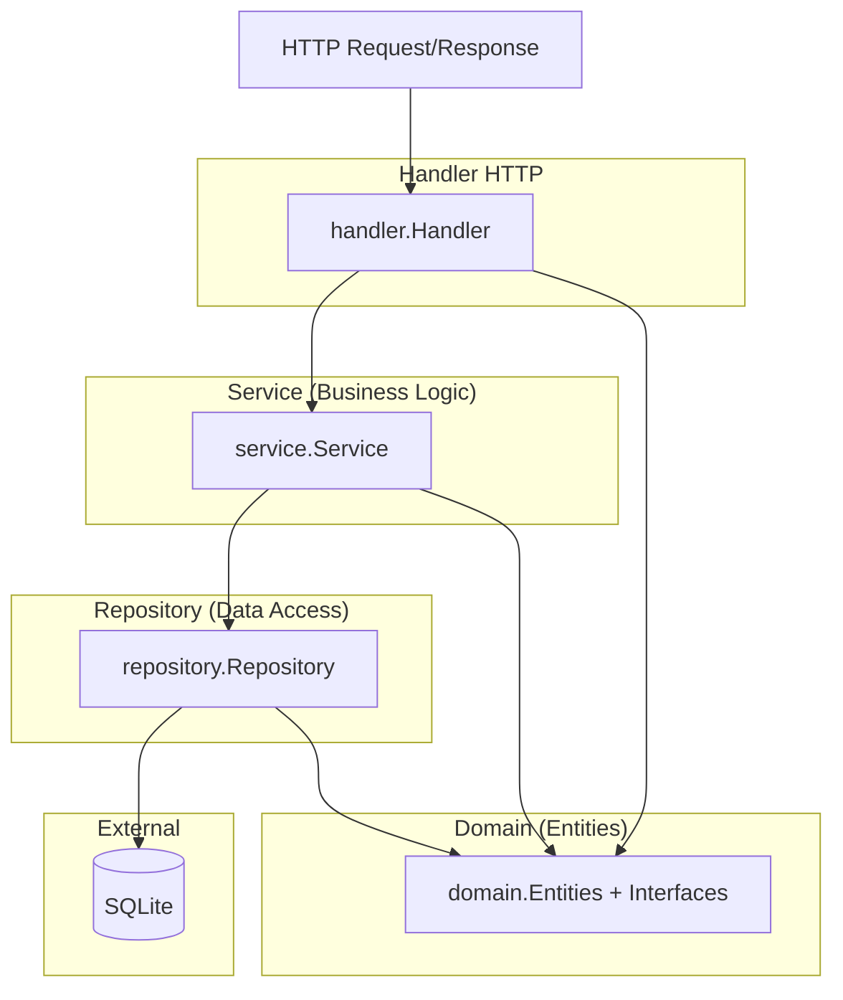
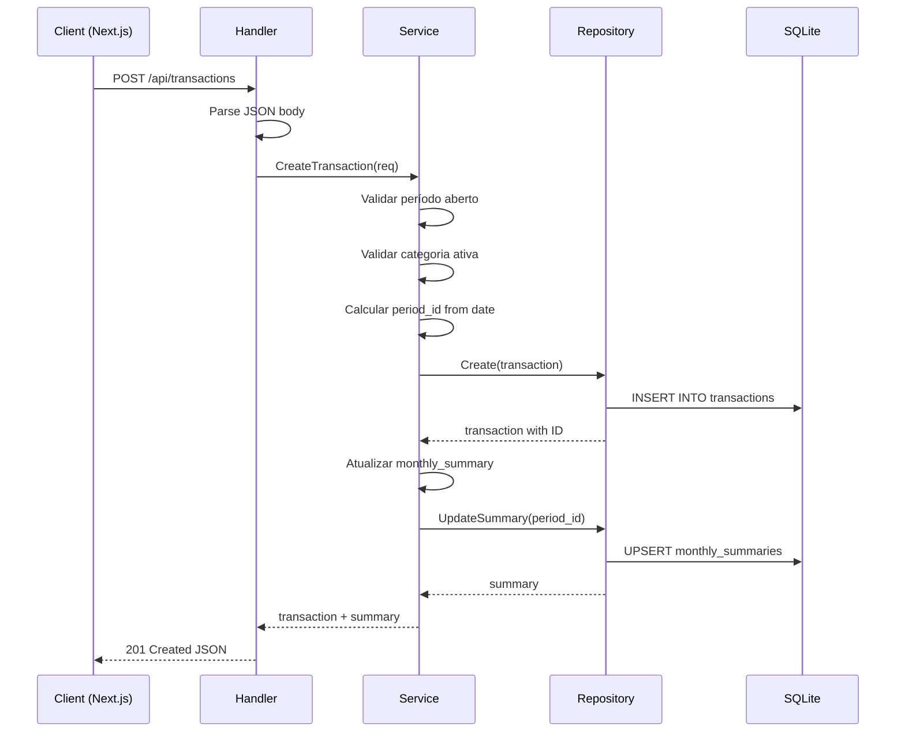
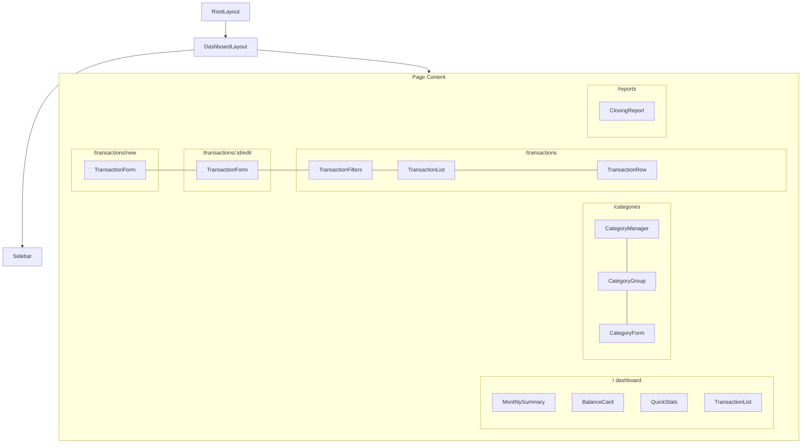

# Arquitetura do Sistema de Controle Financeiro Mensal

> **Visão Geral**: Aplicação web single-user para substituir planilha de controle financeiro mensal, com categorias configuráveis, observações em lançamentos e totais automáticos.

---

## 1. Stack Tecnológica

| Camada | Tecnologia | Versão |
|--------|-----------|--------|
| Frontend | Next.js + TypeScript | 14+ |
| Estilização | Tailwind CSS | 3.x |
| Componentes | shadcn/ui | latest |
| Backend | Go (Golang) | 1.22+ |
| Database | SQLite (dev) / PostgreSQL (futuro) | 3.x |
| MCP | Model Context Protocol | 1.x |

---

## 2. Estrutura de Diretórios

```
finance-tracker/
│
├── backend/                          # API REST em Go
│   ├── cmd/
│   │   └── server/
│   │       └── main.go               # Entry point, wire dependencies
│   │
│   ├── internal/
│   │   ├── domain/                   # Entidades e interfaces (Clean Architecture)
│   │   │   ├── period.go
│   │   │   ├── category_group.go
│   │   │   ├── category.go
│   │   │   ├── transaction.go
│   │   │   └── monthly_summary.go
│   │   │
│   │   ├── repository/               # Implementação SQLite das interfaces
│   │   │   ├── interfaces.go         # Interfaces dos repositórios
│   │   │   ├── period_repository.go
│   │   │   ├── category_repository.go
│   │   │   ├── transaction_repository.go
│   │   │   └── summary_repository.go
│   │   │
│   │   ├── service/                  # Lógica de negócio
│   │   │   ├── transaction_service.go
│   │   │   ├── category_service.go
│   │   │   ├── period_service.go
│   │   │   └── summary_service.go
│   │   │
│   │   ├── handler/                  # Handlers HTTP (controllers)
│   │   │   ├── router.go             # Configuração de rotas
│   │   │   ├── transaction_handler.go
│   │   │   ├── category_handler.go
│   │   │   ├── period_handler.go
│   │   │   └── summary_handler.go
│   │   │
│   │   ├── middleware/               # Middleware HTTP
│   │   │   ├── cors.go
│   │   │   └── logger.go
│   │   │
│   │   └── config/
│   │       └── config.go             # Configurações (DB path, porta, etc.)
│   │
│   ├── migrations/
│   │   ├── 001_initial_schema.sql    # Schema inicial
│   │   └── 002_seed_default_data.sql # Dados padrão
│   │
│   ├── seeds/
│   │   └── main.go                   # Script standalone para popular dados
│   │
│   ├── go.mod
│   └── go.sum
│
├── frontend/                         # Aplicação Next.js
│   ├── src/
│   │   ├── app/                      # App Router (Next.js 14+)
│   │   │   ├── layout.tsx            # Root layout com providers
│   │   │   ├── page.tsx              # Dashboard mensal (/)
│   │   │   │
│   │   │   ├── transactions/
│   │   │   │   ├── page.tsx          # Lista de transações
│   │   │   │   ├── new/
│   │   │   │   │   └── page.tsx      # Novo lançamento
│   │   │   │   └── [id]/
│   │   │   │       └── edit/
│   │   │   │           └── page.tsx  # Editar lançamento
│   │   │   │
│   │   │   ├── categories/
│   │   │   │   └── page.tsx          # Gestão de categorias
│   │   │   │
│   │   │   └── reports/
│   │   │       └── page.tsx          # Relatório de fechamento
│   │   │
│   │   ├── components/
│   │   │   ├── ui/                   # Componentes shadcn/ui (gerados)
│   │   │   │   ├── button.tsx
│   │   │   │   ├── card.tsx
│   │   │   │   ├── dialog.tsx
│   │   │   │   ├── form.tsx
│   │   │   │   ├── input.tsx
│   │   │   │   ├── label.tsx
│   │   │   │   ├── select.tsx
│   │   │   │   ├── table.tsx
│   │   │   │   ├── tabs.tsx
│   │   │   │   └── ... (outros shadcn/ui)
│   │   │   │
│   │   │   ├── layouts/
│   │   │   │   ├── dashboard-layout.tsx   # Layout com sidebar/nav
│   │   │   │   └── sidebar.tsx            # Navegação lateral
│   │   │   │
│   │   │   ├── transactions/
│   │   │   │   ├── transaction-form.tsx   # Formulário de lançamento
│   │   │   │   ├── transaction-list.tsx   # Tabela de lançamentos
│   │   │   │   ├── transaction-row.tsx    # Linha da tabela
│   │   │   │   └── transaction-filters.tsx # Filtros (período, categoria)
│   │   │   │
│   │   │   ├── categories/
│   │   │   │   ├── category-manager.tsx   # Gestão completa
│   │   │   │   ├── category-group.tsx     # Grupo de categorias
│   │   │   │   └── category-form.tsx      # Formulário de categoria
│   │   │   │
│   │   │   ├── dashboard/
│   │   │   │   ├── monthly-summary.tsx    # Resumo do mês
│   │   │   │   ├── balance-card.tsx       # Cartão de saldo
│   │   │   │   └── quick-stats.tsx        # Estatísticas rápidas
│   │   │   │
│   │   │   └── reports/
│   │   │       └── closing-report.tsx     # Relatório de fechamento
│   │   │
│   │   ├── hooks/
│   │   │   ├── use-transactions.ts        # CRUD transações
│   │   │   ├── use-summary.ts             # Resumo mensal
│   │   │   └── use-categories.ts          # CRUD categorias
│   │   │
│   │   ├── lib/
│   │   │   ├── api.ts                     # Cliente HTTP (fetch wrapper)
│   │   │   └── utils.ts                   # Formatação moeda/data
│   │   │
│   │   └── types/
│   │       ├── index.ts                   # Re-exports
│   │       ├── transaction.ts             # Transaction types
│   │       ├── category.ts                # Category types
│   │       ├── period.ts                  # Period types
│   │       └── summary.ts                 # Summary types
│   │
│   ├── public/
│   │   └── favicon.ico
│   │
│   ├── package.json
│   ├── tsconfig.json
│   ├── tailwind.config.ts
│   ├── postcss.config.js
│   ├── next.config.js
│   └── components.json                    # Config shadcn/ui
│
├── docs/
│   ├── ARCHITECTURE.md                    # Este documento
│   └── API.md                             # Especificação da API
│
├── mcp/                                   # Endpoints MCP (futuro)
│   └── README.md
│
├── .gitignore
└── README.md
```

---

## 3. Database Schema (SQLite)

### 3.1 Diagrama ER

```mermaid
erDiagram
    periods ||--o{ transactions : contains
    periods ||--o{ monthly_summaries : summarizes
    category_groups ||--o{ categories : groups
    categories ||--o{ transactions : categorizes

    periods {
        id INTEGER PK
        year INTEGER "NOT NULL"
        month INTEGER "NOT NULL 1-12"
        closed_at DATETIME "NULL se aberto"
        created_at DATETIME "DEFAULT CURRENT_TIMESTAMP"
        updated_at DATETIME "DEFAULT CURRENT_TIMESTAMP"
        UNIQUE(year, month)
    }

    category_groups {
        id INTEGER PK
        name TEXT "NOT NULL ex: Receitas"
        type TEXT "NOT NULL revenue|investment|expense"
        sort_order INTEGER "NOT NULL DEFAULT 0"
        created_at DATETIME "DEFAULT CURRENT_TIMESTAMP"
    }

    categories {
        id INTEGER PK
        group_id INTEGER FK "NOT NULL"
        name TEXT "NOT NULL"
        expense_type TEXT "NULL|fixed|variable|extra|additional"
        sort_order INTEGER "NOT NULL DEFAULT 0"
        active INTEGER "NOT NULL DEFAULT 1"
        created_at DATETIME "DEFAULT CURRENT_TIMESTAMP"
        updated_at DATETIME "DEFAULT CURRENT_TIMESTAMP"
        FOREIGN KEY group_id REFERENCES category_groups(id)
    }

    transactions {
        id INTEGER PK
        period_id INTEGER FK "NOT NULL"
        category_id INTEGER FK "NOT NULL"
        date TEXT "NOT NULL ISO YYYY-MM-DD"
        amount INTEGER "NOT NULL em centavos"
        type TEXT "NOT NULL income|investment|expense"
        note TEXT "NOT NULL DEFAULT ''"
        created_at DATETIME "DEFAULT CURRENT_TIMESTAMP"
        updated_at DATETIME "DEFAULT CURRENT_TIMESTAMP"
        FOREIGN KEY period_id REFERENCES periods(id)
        FOREIGN KEY category_id REFERENCES categories(id)
    }

    monthly_summaries {
        id INTEGER PK
        period_id INTEGER FK "NOT NULL UNIQUE"
        revenue_total INTEGER "NOT NULL DEFAULT 0"
        investment_total INTEGER "NOT NULL DEFAULT 0"
        fixed_expense_total INTEGER "NOT NULL DEFAULT 0"
        variable_expense_total INTEGER "NOT NULL DEFAULT 0"
        extra_expense_total INTEGER "NOT NULL DEFAULT 0"
        additional_expense_total INTEGER "NOT NULL DEFAULT 0"
        balance INTEGER "NOT NULL DEFAULT 0"
        created_at DATETIME "DEFAULT CURRENT_TIMESTAMP"
        updated_at DATETIME "DEFAULT CURRENT_TIMESTAMP"
        FOREIGN KEY period_id REFERENCES periods(id)
    }
```

### 3.2 SQL de Migração Inicial

```sql
-- migrations/001_initial_schema.sql

CREATE TABLE IF NOT EXISTS periods (
    id INTEGER PRIMARY KEY AUTOINCREMENT,
    year INTEGER NOT NULL,
    month INTEGER NOT NULL CHECK(month >= 1 AND month <= 12),
    closed_at DATETIME DEFAULT NULL,
    created_at DATETIME DEFAULT CURRENT_TIMESTAMP,
    updated_at DATETIME DEFAULT CURRENT_TIMESTAMP,
    UNIQUE(year, month)
);

CREATE TABLE IF NOT EXISTS category_groups (
    id INTEGER PRIMARY KEY AUTOINCREMENT,
    name TEXT NOT NULL,
    type TEXT NOT NULL CHECK(type IN ('revenue', 'investment', 'expense')),
    sort_order INTEGER NOT NULL DEFAULT 0,
    created_at DATETIME DEFAULT CURRENT_TIMESTAMP
);

CREATE TABLE IF NOT EXISTS categories (
    id INTEGER PRIMARY KEY AUTOINCREMENT,
    group_id INTEGER NOT NULL,
    name TEXT NOT NULL,
    expense_type TEXT CHECK(expense_type IN ('fixed', 'variable', 'extra', 'additional') OR expense_type IS NULL),
    sort_order INTEGER NOT NULL DEFAULT 0,
    active INTEGER NOT NULL DEFAULT 1,
    created_at DATETIME DEFAULT CURRENT_TIMESTAMP,
    updated_at DATETIME DEFAULT CURRENT_TIMESTAMP,
    FOREIGN KEY (group_id) REFERENCES category_groups(id)
);

CREATE TABLE IF NOT EXISTS transactions (
    id INTEGER PRIMARY KEY AUTOINCREMENT,
    period_id INTEGER NOT NULL,
    category_id INTEGER NOT NULL,
    date TEXT NOT NULL,
    amount INTEGER NOT NULL,
    type TEXT NOT NULL CHECK(type IN ('income', 'investment', 'expense')),
    note TEXT NOT NULL DEFAULT '',
    created_at DATETIME DEFAULT CURRENT_TIMESTAMP,
    updated_at DATETIME DEFAULT CURRENT_TIMESTAMP,
    FOREIGN KEY (period_id) REFERENCES periods(id),
    FOREIGN KEY (category_id) REFERENCES categories(id)
);

CREATE TABLE IF NOT EXISTS monthly_summaries (
    id INTEGER PRIMARY KEY AUTOINCREMENT,
    period_id INTEGER NOT NULL UNIQUE,
    revenue_total INTEGER NOT NULL DEFAULT 0,
    investment_total INTEGER NOT NULL DEFAULT 0,
    fixed_expense_total INTEGER NOT NULL DEFAULT 0,
    variable_expense_total INTEGER NOT NULL DEFAULT 0,
    extra_expense_total INTEGER NOT NULL DEFAULT 0,
    additional_expense_total INTEGER NOT NULL DEFAULT 0,
    balance INTEGER NOT NULL DEFAULT 0,
    created_at DATETIME DEFAULT CURRENT_TIMESTAMP,
    updated_at DATETIME DEFAULT CURRENT_TIMESTAMP,
    FOREIGN KEY (period_id) REFERENCES periods(id)
);

CREATE INDEX idx_transactions_period_id ON transactions(period_id);
CREATE INDEX idx_transactions_category_id ON transactions(category_id);
CREATE INDEX idx_transactions_date ON transactions(date);
CREATE INDEX idx_categories_group_id ON categories(group_id);
```

### 3.3 Regras de Negócio do Schema

| Regra | Descrição |
|-------|-----------|
| **amount em centavos** | `R$ 1.234,56` → `123456` (INTEGER). Evita problemas de arredondamento. |
| **type em transactions** | Deve ser compatível com o `type` do `category_groups` da categoria vinculada. |
| **expense_type** | Só aplicável se a categoria pertence a um grupo do tipo `expense`. |
| **period** | Determinado automaticamente pela `date` no momento da criação da transação. |
| **monthly_summaries** | Tabela materializada para leitura rápida. Atualizada via trigger ou serviço. |
| **closed_at** | Período fechado não pode receber novas transações (validação em serviço). |

---

## 4. Backend — Clean Architecture em Go

### 4.1 Camadas e Responsabilidades



### 4.2 Fluxo de Dados (Exemplo: Criar Transação)



### 4.3 Pacote `domain/` — Entidades

```go
// domain/period.go
type Period struct {
    ID        int64      `json:"id"`
    Year      int        `json:"year"`
    Month     int        `json:"month"`
    ClosedAt  *time.Time `json:"closed_at,omitempty"`
    CreatedAt time.Time  `json:"created_at"`
    UpdatedAt time.Time  `json:"updated_at"`
}

// domain/category_group.go
type CategoryGroupType string

const (
    GroupTypeRevenue     CategoryGroupType = "revenue"
    GroupTypeInvestment  CategoryGroupType = "investment"
    GroupTypeExpense     CategoryGroupType = "expense"
)

type CategoryGroup struct {
    ID        int64             `json:"id"`
    Name      string            `json:"name"`
    Type      CategoryGroupType `json:"type"`
    SortOrder int               `json:"sort_order"`
    CreatedAt time.Time         `json:"created_at"`
}

// domain/category.go
type ExpenseType string

const (
    ExpenseTypeFixed       ExpenseType = "fixed"
    ExpenseTypeVariable    ExpenseType = "variable"
    ExpenseTypeExtra       ExpenseType = "extra"
    ExpenseTypeAdditional  ExpenseType = "additional"
)

type Category struct {
    ID          int64        `json:"id"`
    GroupID     int64        `json:"group_id"`
    Name        string       `json:"name"`
    ExpenseType *ExpenseType `json:"expense_type,omitempty"`
    SortOrder   int          `json:"sort_order"`
    Active      bool         `json:"active"`
    CreatedAt   time.Time    `json:"created_at"`
    UpdatedAt   time.Time    `json:"updated_at"`
}

// domain/transaction.go
type TransactionType string

const (
    TransactionIncome      TransactionType = "income"
    TransactionInvestment  TransactionType = "investment"
    TransactionExpense     TransactionType = "expense"
)

type Transaction struct {
    ID          int64           `json:"id"`
    PeriodID    int64           `json:"period_id"`
    CategoryID  int64           `json:"category_id"`
    Date        string          `json:"date"`       // ISO YYYY-MM-DD
    Amount      int64           `json:"amount"`     // em centavos
    Type        TransactionType `json:"type"`
    Note        string          `json:"note"`
    CreatedAt   time.Time       `json:"created_at"`
    UpdatedAt   time.Time       `json:"updated_at"`
    // Joined fields (opcional)
    CategoryName string `json:"category_name,omitempty"`
    PeriodLabel  string `json:"period_label,omitempty"` // "2026-05"
}

// domain/monthly_summary.go
type MonthlySummary struct {
    ID                   int64     `json:"id"`
    PeriodID             int64     `json:"period_id"`
    RevenueTotal         int64     `json:"revenue_total"`
    InvestmentTotal      int64     `json:"investment_total"`
    FixedExpenseTotal    int64     `json:"fixed_expense_total"`
    VariableExpenseTotal int64     `json:"variable_expense_total"`
    ExtraExpenseTotal    int64     `json:"extra_expense_total"`
    AdditionalExpenseTotal int64   `json:"additional_expense_total"`
    Balance              int64     `json:"balance"`
    CreatedAt            time.Time `json:"created_at"`
    UpdatedAt            time.Time `json:"updated_at"`
}
```

### 4.4 Pacote `repository/interfaces.go` — Contratos

```go
type TransactionRepository interface {
    Create(tx *domain.Transaction) error
    GetByID(id int64) (*domain.Transaction, error)
    List(period string) ([]*domain.Transaction, error)
    Update(tx *domain.Transaction) error
    Delete(id int64) error
}

type CategoryRepository interface {
    List() ([]*domain.Category, error)
    GetByID(id int64) (*domain.Category, error)
    Create(cat *domain.Category) error
    Update(cat *domain.Category) error
}

type PeriodRepository interface {
    GetOrCreate(year, month int) (*domain.Period, error)
    List() ([]*domain.Period, error)
    Close(id int64) error
    GetByID(id int64) (*domain.Period, error)
}

type SummaryRepository interface {
    GetByPeriodID(periodID int64) (*domain.MonthlySummary, error)
    Recalculate(periodID int64) (*domain.MonthlySummary, error)
}
```

---

## 5. Frontend — Next.js + TypeScript

### 5.1 Árvore de Componentes



### 5.2 TypeScript Types

```typescript
// types/transaction.ts
export interface Transaction {
  id: number;
  period_id: number;
  category_id: number;
  date: string; // YYYY-MM-DD
  amount: number; // em centavos
  type: 'income' | 'investment' | 'expense';
  note: string;
  created_at: string;
  updated_at: string;
  category_name?: string;
  period_label?: string;
}

export interface CreateTransactionPayload {
  category_id: number;
  date: string;
  amount: number;
  type: 'income' | 'investment' | 'expense';
  note: string;
}

export interface UpdateTransactionPayload extends Partial<CreateTransactionPayload> {}

// types/category.ts
export interface CategoryGroup {
  id: number;
  name: string;
  type: 'revenue' | 'investment' | 'expense';
  sort_order: number;
}

export type ExpenseType = 'fixed' | 'variable' | 'extra' | 'additional';

export interface Category {
  id: number;
  group_id: number;
  name: string;
  expense_type: ExpenseType | null;
  sort_order: number;
  active: boolean;
  created_at: string;
  updated_at: string;
}

export interface CreateCategoryPayload {
  group_id: number;
  name: string;
  expense_type?: ExpenseType | null;
  sort_order?: number;
}

// types/period.ts
export interface Period {
  id: number;
  year: number;
  month: number;
  closed_at: string | null;
  created_at: string;
  updated_at: string;
}

export interface ClosePeriodPayload {
  year: number;
  month: number;
}

// types/summary.ts
export interface MonthlySummary {
  id: number;
  period_id: number;
  revenue_total: number;
  investment_total: number;
  fixed_expense_total: number;
  variable_expense_total: number;
  extra_expense_total: number;
  additional_expense_total: number;
  balance: number;
  created_at: string;
  updated_at: string;
}
```

### 5.3 Custom Hooks

```typescript
// hooks/use-transactions.ts
interface UseTransactionsReturn {
  transactions: Transaction[];
  loading: boolean;
  error: string | null;
  fetchByPeriod: (period: string) => Promise<void>;
  create: (data: CreateTransactionPayload) => Promise<Transaction>;
  update: (id: number, data: UpdateTransactionPayload) => Promise<Transaction>;
  remove: (id: number) => Promise<void>;
}

// hooks/use-summary.ts
interface UseSummaryReturn {
  summary: MonthlySummary | null;
  loading: boolean;
  error: string | null;
  fetchByPeriod: (period: string) => Promise<void>;
}

// hooks/use-categories.ts
interface UseCategoriesReturn {
  categories: Category[];
  groups: CategoryGroup[];
  loading: boolean;
  error: string | null;
  fetchAll: () => Promise<void>;
  create: (data: CreateCategoryPayload) => Promise<Category>;
  update: (id: number, data: Partial<CreateCategoryPayload>) => Promise<Category>;
}
```

### 5.4 Cliente HTTP

```typescript
// lib/api.ts
const API_BASE = process.env.NEXT_PUBLIC_API_URL || 'http://localhost:8080';

async function fetchAPI<T>(
  endpoint: string,
  options?: RequestInit
): Promise<T> {
  const res = await fetch(`${API_BASE}${endpoint}`, {
    headers: { 'Content-Type': 'application/json' },
    ...options,
  });
  
  if (!res.ok) {
    const error = await res.json().catch(() => ({}));
    throw new ApiError(res.status, error.message || 'Erro na requisição');
  }
  
  return res.json();
}

// Métodos helpers
export const api = {
  get: <T>(url: string) => fetchAPI<T>(url),
  post: <T>(url: string, data: unknown) =>
    fetchAPI<T>(url, { method: 'POST', body: JSON.stringify(data) }),
  patch: <T>(url: string, data: unknown) =>
    fetchAPI<T>(url, { method: 'PATCH', body: JSON.stringify(data) }),
  delete: <T>(url: string) =>
    fetchAPI<T>(url, { method: 'DELETE' }),
};
```

---

## 6. Rotas Frontend

| Path | Page Component | Descrição |
|------|---------------|-----------|
| `/` | `app/page.tsx` | Dashboard com resumo mensal, saldo, e últimas transações |
| `/transactions` | `app/transactions/page.tsx` | Lista completa com filtros por período, categoria, tipo |
| `/transactions/new` | `app/transactions/new/page.tsx` | Formulário de novo lançamento |
| `/transactions/[id]/edit` | `app/transactions/[id]/edit/page.tsx` | Edição de lançamento existente |
| `/categories` | `app/categories/page.tsx` | Gestão de grupos e categorias |
| `/reports` | `app/reports/page.tsx` | Relatório consolidado de fechamento mensal |

### 6.1 Navegação (Sidebar)

```
📊 Dashboard        → /
💳 Transações       → /transactions
📂 Categorias       → /categories
📈 Relatórios       → /reports
```

---

## 7. Plano de Implementação

### Fase 1 — Fundação (Dias 1-2)

| Etapa | Tarefa | Depende de |
|-------|--------|-----------|
| 1.1 | Setup do monorepo (pastas, .gitignore, README) | — |
| 1.2 | Backend: `go mod init`, dependências, config | 1.1 |
| 1.3 | Backend: migrations SQL + seed de categorias padrão | 1.2 |
| 1.4 | Backend: domain entities e repository interfaces | 1.3 |
| 1.5 | Frontend: `npx create-next-app` com Tailwind + shadcn/ui | 1.1 |
| 1.6 | Frontend: types TypeScript + lib/api.ts | 1.5 |

### Fase 2 — Core Backend (Dias 3-5)

| Etapa | Tarefa | Depende de |
|-------|--------|-----------|
| 2.1 | Repository: implementação SQLite de categories | 1.4 |
| 2.2 | Repository: implementação SQLite de periods | 1.4 |
| 2.3 | Repository: implementação SQLite de transactions | 1.4 |
| 2.4 | Repository: implementação SQLite de summary | 1.4 |
| 2.5 | Service: category_service (CRUD + validações) | 2.1 |
| 2.6 | Service: period_service (getOrCreate, close) | 2.2 |
| 2.7 | Service: transaction_service (CRUD + validação período aberto) | 2.3, 2.6 |
| 2.8 | Service: summary_service (cálculo de totais) | 2.4, 2.7 |
| 2.9 | Handler: router + handlers HTTP + middleware | 2.5, 2.6, 2.7, 2.8 |
| 2.10 | Handler: `main.go` com wiring e startup | 2.9 |

### Fase 3 — Core Frontend (Dias 6-8)

| Etapa | Tarefa | Depende de |
|-------|--------|-----------|
| 3.1 | Layout: DashboardLayout + Sidebar | 1.5 |
| 3.2 | Hook: useCategories + CategoryManager page | 2.1 |
| 3.3 | Hook: useTransactions + TransactionList + TransactionForm | 2.3, 2.7 |
| 3.4 | Hook: useSummary + MonthlySummary + BalanceCard | 2.8 |
| 3.5 | Dashboard page: integrar cards + lista recente | 3.1, 3.2, 3.3, 3.4 |
| 3.6 | Transactions pages: list, new, edit | 3.3 |
| 3.7 | Categories page: CRUD completo | 3.2 |
| 3.8 | Reports page: relatório de fechamento | 3.4 |

### Fase 4 — Polimento (Dias 9-10)

| Etapa | Tarefa | Depende de |
|-------|--------|-----------|
| 4.1 | Loading skeletons + estados vazios + error states | 3.5, 3.6, 3.7, 3.8 |
| 4.2 | Formatação monetária (R$), data (pt-BR) | 3.5 |
| 4.3 | Responsividade (mobile-first) | 3.1 |
| 4.4 | Seed script com dados de exemplo | 1.3 |
| 4.5 | README com instruções de setup | 2.10, 1.5 |

### Fase 5 — MCP e Automação (Futuro)

| Etapa | Tarefa | Depende de |
|-------|--------|-----------|
| 5.1 | Endpoints MCP para consulta de dados | 2.0 |
| 5.2 | Endpoints MCP para criação de transações | 2.0 |
| 5.3 | Documentação MCP | 5.1, 5.2 |

---

## 8. Decisões Técnicas

| Decisão | Opção Escolhida | Alternativas | Motivo |
|---------|----------------|-------------|--------|
| **Storage de valores** | INTEGER (centavos) | FLOAT, DECIMAL | Precisão absoluta, sem arredondamento |
| **Período** | Tabela `periods` gerada por demanda | Cálculo via SQL da data | Performance em consultas de summary |
| **Summary** | Tabela materializada | Cálculo sob demanda | Leitura rápida no dashboard |
| **Router Go** | `net/http` padrão + `http.ServeMux` | chi, gorilla/mux | Go 1.22+ tem pattern matching, menos dependências |
| **Driver SQLite** | `modernc.org/sqlite` (pure Go) | mattn/go-sqlite3 (CGO) | Sem necessidade de CGO, build simples |
| **Migrations** | SQL puro executado na inicialização | golang-migrate, goose | Simplicidade para single-user |
| **Estado frontend** | Hooks customizados + fetch direto | React Query, SWR | Simplicidade inicial, sem cache server-side |
| **Formulários** | shadcn/ui Form + React Hook Form | Formik, Final Form | Já incluso no ecossistema shadcn/ui |
| **CSS** | Tailwind CSS + shadcn/ui | Styled Components, CSS Modules | Padrão Next.js 14+, colocado com shadcn/ui |

---

## 9. Dependências Externas

### Backend (Go)

```
modernc.org/sqlite     # Driver SQLite puro Go (sem CGO)
github.com/go-chi/cors  # Middleware CORS (opcional, ou manual)
```

### Frontend (Node.js)

```json
{
  "next": "14.x",
  "react": "^18",
  "react-dom": "^18",
  "tailwindcss": "^3.x",
  "typescript": "^5.x",
  "@radix-ui/react-dialog": "^1.x",
  "@radix-ui/react-label": "^2.x",
  "@radix-ui/react-select": "^2.x",
  "@radix-ui/react-tabs": "^1.x",
  "react-hook-form": "^7.x",
  "@hookform/resolvers": "^3.x",
  "zod": "^3.x",
  "lucide-react": "^0.x",
  "class-variance-authority": "^0.x",
  "clsx": "^2.x",
  "tailwind-merge": "^2.x",
  "tailwindcss-animate": "^1.x"
}
```

---

## 10. Variáveis de Ambiente

### Backend (`.env`)

```env
# backend/.env
PORT=8080
DB_PATH=./data/finance.db
```

### Frontend (`.env.local`)

```env
# frontend/.env.local
NEXT_PUBLIC_API_URL=http://localhost:8080
```
