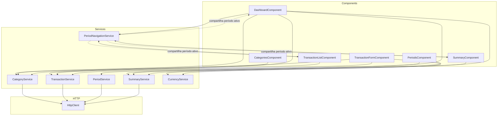
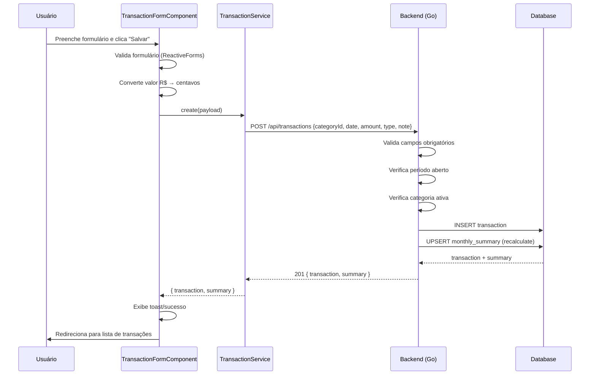

# Plano de Arquitetura — Frontend Angular + Tailwind CSS

## Sumário

1. [Stack Tecnológica](#1-stack-tecnológica)
2. [Princípios SOLID Aplicados](#2-princípios-solid-aplicados)
3. [Estrutura de Diretórios](#3-estrutura-de-diretórios)
4. [Modelos de Dados / Interfaces](#4-modelos-de-dados--interfaces)
5. [Mapeamento de Endpoints da API](#5-mapeamento-de-endpoints-da-api)
6. [Camada de Serviços (Services)](#6-camada-de-serviços-services)
7. [Componentes e Funcionalidades](#7-componentes-e-funcionalidades)
8. [Roteamento com Lazy Loading](#8-roteamento-com-lazy-loading)
9. [Configuração do Tailwind CSS](#9-configuração-do-tailwind-css)
10. [Fluxo de Dados e Exemplos](#10-fluxo-de-dados-e-exemplos)
11. [Plano de Implementação (TODO)](#11-plano-de-implementação-todo)

---

## 1. Stack Tecnológica

| Camada        | Tecnologia                | Versão Mínima |
|---------------|---------------------------|---------------|
| Framework     | Angular (Standalone)      | 17+           |
| Linguagem     | TypeScript                | 5.x           |
| Estilização   | Tailwind CSS              | 3.x           |
| Ícones        | Lucide Icons (via ng-lucide) | última      |
| Formulários   | Reactive Forms (nativo)   | —             |
| HTTP          | Angular HttpClient        | —             |
| Build         | Angular CLI               | 17+           |
| Testes        | Jasmine + Karma (padrão)  | —             |

**Nota:** Prefira componentes **standalone** (sem NgModules) para alinhar com Angular 17+ e facilitar lazy loading.

---

## 2. Princípios SOLID Aplicados

### SRP — Single Responsibility Principle

Cada serviço tem **uma única responsabilidade**:

| Serviço               | Responsabilidade                          |
|-----------------------|-------------------------------------------|
| `CategoryService`     | Operações CRUD de categorias/grupos       |
| `TransactionService`  | Operações CRUD de transações              |
| `PeriodService`       | Listagem e fechamento de períodos         |
| `SummaryService`      | Consulta de resumo mensal                 |
| `CurrencyService`     | Formatação de valores (centavos → R$)     |
| `PeriodNavigationService` | Estado do período selecionado (sessão) |

### OCP — Open/Closed Principle

Os serviços consomem **interfaces abstratas** via injeção de dependência. Para estender o comportamento (ex.: adicionar cache), basta criar uma nova implementação que implemente a mesma interface e trocá-la no provider.

### LSP — Liskov Substitution Principle

Interfaces definem contratos. Exemplo: `HttpCategoryService` e `FakeCategoryService` (para testes) implementam `CategoryServiceInterface`. Qualquer uma pode ser injetada sem quebrar os consumidores.

### ISP — Interface Segregation Principle

Interfaces são **pequenas e focadas** — cada serviço expõe apenas os métodos de que seus consumidores precisam. Nada de um "megaserviço" genérico.

### DIP — Dependency Inversion Principle

Componentes dependem de **abstrações** (interfaces), não de classes concretas. O Angular Injector resolve a implementação concreta em tempo de execução.

```typescript
// Exemplo de DIP
@Component({...})
export class TransactionListComponent {
  constructor(
    private transactionService: TransactionServiceInterface  // depende da abstração
  ) {}
}
```

---

## 3. Estrutura de Diretórios

```
frontend/
├── src/
│   ├── app/
│   │   ├── app.config.ts              // ApplicationConfig com providers
│   │   ├── app.routes.ts              // Rotas principais (lazy)
│   │   ├── app.component.ts           // Root component
│   │   │
│   │   ├── core/                      // Singleton, providers raiz
│   │   │   ├── interfaces/            // Modelos/domínios
│   │   │   │   ├── category.interface.ts
│   │   │   │   ├── transaction.interface.ts
│   │   │   │   ├── period.interface.ts
│   │   │   │   ├── summary.interface.ts
│   │   │   │   └── api-response.interface.ts
│   │   │   │
│   │   │   ├── services/              // Serviços HTTP abstratos
│   │   │   │   ├── category.service.ts
│   │   │   │   ├── transaction.service.ts
│   │   │   │   ├── period.service.ts
│   │   │   │   └── summary.service.ts
│   │   │   │
│   │   │   ├── utils/                 // Utilitários
│   │   │   │   ├── currency.utils.ts  // Centavos ↔ R$
│   │   │   │   ├── date.utils.ts      // Formatação de data pt-BR
│   │   │   │   └── period.utils.ts    // Manipulação de período YYYY-MM
│   │   │   │
│   │   │   └── layouts/               // Layouts compartilhados
│   │   │       ├── sidebar.component.ts
│   │   │       └── main-layout.component.ts
│   │   │
│   │   ├── features/                  // Módulos de funcionalidade (lazy)
│   │   │   ├── dashboard/             // Página inicial
│   │   │   │   ├── dashboard.component.ts
│   │   │   │   ├── dashboard.routes.ts
│   │   │   │   └── components/
│   │   │   │       ├── balance-card.component.ts
│   │   │   │       ├── summary-cards.component.ts
│   │   │   │       └── recent-transactions.component.ts
│   │   │   │
│   │   │   ├── transactions/          // CRUD transações
│   │   │   │   ├── transactions.component.ts        // Lista
│   │   │   │   ├── transaction-form.component.ts    // Formulário
│   │   │   │   ├── transactions.routes.ts
│   │   │   │   └── components/
│   │   │   │       ├── transaction-table.component.ts
│   │   │   │       ├── transaction-row.component.ts
│   │   │   │       └── period-filter.component.ts
│   │   │   │
│   │   │   ├── categories/            // Gestão de categorias
│   │   │   │   ├── categories.component.ts
│   │   │   │   ├── category-form.component.ts
│   │   │   │   ├── categories.routes.ts
│   │   │   │   └── components/
│   │   │   │       └── category-group.component.ts
│   │   │   │
│   │   │   ├── periods/               // Fechamento de períodos
│   │   │   │   ├── periods.component.ts
│   │   │   │   └── periods.routes.ts
│   │   │   │
│   │   │   └── summary/               // Resumo mensal detalhado
│   │   │       ├── summary.component.ts
│   │   │       └── summary.routes.ts
│   │   │
│   │   └── shared/                    // Componentes reutilizáveis
│   │       ├── components/
│   │       │   ├── confirm-dialog.component.ts
│   │       │   ├── empty-state.component.ts
│   │       │   ├── loading-spinner.component.ts
│   │       │   └── page-header.component.ts
│   │       └── pipes/
│   │           ├── currency.pipe.ts   // R$ 1.500,00
│   │           └── date.pipe.ts       // 10 de maio de 2026
│   │
│   ├── assets/
│   │   └── .gitkeep
│   │
│   ├── styles/
│   │   └── tailwind.css              // Diretivas Tailwind
│   │
│   ├── index.html
│   ├── main.ts
│   └── environments/
│       ├── environment.ts
│       └── environment.prod.ts
│
├── angular.json
├── tailwind.config.js
├── tsconfig.json
├── package.json
└── .env.local                   // NEXT_PUBLIC_API_URL=http://localhost:8080
```

---

## 4. Modelos de Dados / Interfaces

### 4.1 Estrutura Padrão da API

```typescript
// core/interfaces/api-response.interface.ts

export interface ApiResponse<T> {
  success: boolean;
  data?: T;
  error?: ApiError;
}

export interface ApiError {
  code: string;
  message: string;
}
```

### 4.2 Category

```typescript
// core/interfaces/category.interface.ts

export type CategoryGroupType = 'revenue' | 'investment' | 'expense';
export type ExpenseType = 'fixed' | 'variable' | 'extra' | 'additional';

export interface CategoryGroup {
  id: number;
  name: string;
  type: CategoryGroupType;
  sortOrder: number;
  createdAt: string;     // ISO datetime
  categories?: Category[];
}

export interface Category {
  id: number;
  groupId: number;
  name: string;
  expenseType: ExpenseType | null;
  sortOrder: number;
  active: boolean;
  createdAt: string;
  updatedAt: string;
}

// Payloads para criação/atualização
export interface CreateCategoryPayload {
  groupId: number;
  name: string;
  expenseType?: ExpenseType | null;
  sortOrder?: number;
}

export interface UpdateCategoryPayload {
  name?: string;
  expenseType?: ExpenseType | null;
  sortOrder?: number;
  active?: boolean;
}
```

### 4.3 Transaction

```typescript
// core/interfaces/transaction.interface.ts

export type TransactionType = 'income' | 'investment' | 'expense';

export interface Transaction {
  id: number;
  periodId: number;
  categoryId: number;
  date: string;               // YYYY-MM-DD
  amount: number;             // em centavos
  note: string;
  type: TransactionType;
  createdAt: string;
  updatedAt: string;
  period?: Period;
  category?: Category;
}

export interface CreateTransactionPayload {
  categoryId: number;
  date: string;
  amount: number;             // em centavos
  type: TransactionType;
  note: string;
}

// PATCH aceita campos parciais
export interface UpdateTransactionPayload {
  categoryId?: number;
  date?: string;
  amount?: number;
  type?: TransactionType;
  note?: string;
}
```

### 4.4 Period

```typescript
// core/interfaces/period.interface.ts

export interface Period {
  id: number;
  year: number;
  month: number;
  closedAt: string | null;    // null se aberto
  createdAt: string;
  updatedAt: string;
}

export interface PeriodListItem {
  id: number;
  year: number;
  month: number;
  label: string;              // "2026-05"
  closedAt: string | null;
  createdAt: string;
  updatedAt: string;
  balance?: number;
  revenueTotal?: number;
  investmentTotal?: number;
  fixedExpenseTotal?: number;
  variableExpenseTotal?: number;
  extraExpenseTotal?: number;
  additionalExpenseTotal?: number;
}

export interface ClosePeriodPayload {
  year: number;
  month: number;
}
```

### 4.5 MonthlySummary

```typescript
// core/interfaces/summary.interface.ts

export interface MonthlySummary {
  id: number;
  periodId: number;
  revenueTotal: number;
  investmentTotal: number;
  fixedExpenseTotal: number;
  variableExpenseTotal: number;
  extraExpenseTotal: number;
  additionalExpenseTotal: number;
  balance: number;
  createdAt: string;
  updatedAt: string;
}
```

---

## 5. Mapeamento de Endpoints da API

Base URL: `http://localhost:8080/api`

| Método | Endpoint                    | Descrição               | Request Body       | Response (data)                        |
|--------|-----------------------------|-------------------------|--------------------|----------------------------------------|
| POST   | `/api/transactions`         | Criar transação         | `CreateTransactionPayload` | `{ transaction, summary }`      |
| GET    | `/api/transactions?period=` | Listar por período      | —                  | `{ transactions[], total, period }`    |
| PATCH  | `/api/transactions/{id}`    | Atualizar transação     | `UpdateTransactionPayload` | `{ transaction, summary }`      |
| DELETE | `/api/transactions/{id}`    | Excluir transação       | —                  | `{ message, summary }`                 |
| GET    | `/api/categories`           | Listar grupos (com cats)| —                  | `{ groups[] }`                         |
| POST   | `/api/categories`           | Criar categoria         | `CreateCategoryPayload` | `Category`                        |
| PATCH  | `/api/categories/{id}`      | Atualizar categoria     | `UpdateCategoryPayload` | `Category`                        |
| DELETE | `/api/categories/{id}`      | Excluir categoria       | —                  | `{ message }`                          |
| GET    | `/api/periods`              | Listar períodos         | —                  | `{ periods[] }`                        |
| POST   | `/api/periods/close`        | Fechar período          | `ClosePeriodPayload` | `{ message, period }`               |
| GET    | `/api/summary?period=`      | Obter resumo mensal     | —                  | `{ summary, period }`                  |
| GET    | `/api/health`               | Health check            | —                  | `{ status }`                           |

**Convenção:** A API usa **camelCase** tanto em requests quanto em responses (observado no código Go). Exceção: alguns campos como `expense_type` no request de criação de categoria usam snake_case — padronizar tudo como camelCase no frontend.

**Formato da resposta de erro:**
```json
{
  "success": false,
  "error": {
    "code": "validation_error",
    "message": "Descrição do erro"
  }
}
```

**Códigos de erro:**
| HTTP Status | Código            | Significado                            |
|-------------|-------------------|----------------------------------------|
| 400         | `validation_error` | Dados inválidos ou campos obrigatórios |
| 404         | `not_found`        | Recurso não encontrado                 |
| 422         | `period_closed`    | Período já está fechado                |
| 409         | `already_closed`   | Tentativa de fechar período já fechado |
| 500         | `internal_error`   | Erro interno do servidor               |

---

## 6. Camada de Serviços (Services)

### 6.1 Diagrama de Dependências



### 6.2 CategoryService

```typescript
// core/services/category.service.ts

@Injectable({ providedIn: 'root' })
export class CategoryService {
  constructor(private http: HttpClient) {}

  /** GET /api/categories - Retorna grupos com categorias aninhadas */
  list(): Observable<CategoryGroup[]> {
    return this.http.get<ApiResponse<{ groups: CategoryGroup[] }>>(`${API_URL}/api/categories`)
      .pipe(map(res => res.data!.groups));
  }

  /** POST /api/categories */
  create(payload: CreateCategoryPayload): Observable<Category> {
    return this.http.post<ApiResponse<Category>>(`${API_URL}/api/categories`, payload)
      .pipe(map(res => res.data!));
  }

  /** PATCH /api/categories/:id */
  update(id: number, payload: UpdateCategoryPayload): Observable<Category> {
    return this.http.patch<ApiResponse<Category>>(`${API_URL}/api/categories/${id}`, payload)
      .pipe(map(res => res.data!));
  }

  /** DELETE /api/categories/:id */
  delete(id: number): Observable<void> {
    return this.http.delete<ApiResponse<{ message: string }>>(`${API_URL}/api/categories/${id}`)
      .pipe(map(() => undefined));
  }
}
```

### 6.3 TransactionService

```typescript
// core/services/transaction.service.ts

export interface TransactionListResponse {
  transactions: Transaction[];
  total: number;
  period: string;
}

export interface TransactionMutationResponse {
  transaction: Transaction;
  summary: MonthlySummary;
}

@Injectable({ providedIn: 'root' })
export class TransactionService {
  constructor(private http: HttpClient) {}

  /** GET /api/transactions?period=YYYY-MM */
  listByPeriod(period: string): Observable<TransactionListResponse> {
    return this.http.get<ApiResponse<TransactionListResponse>>(
      `${API_URL}/api/transactions?period=${period}`
    ).pipe(map(res => res.data!));
  }

  /** POST /api/transactions */
  create(payload: CreateTransactionPayload): Observable<TransactionMutationResponse> {
    return this.http.post<ApiResponse<TransactionMutationResponse>>(
      `${API_URL}/api/transactions`, payload
    ).pipe(map(res => res.data!));
  }

  /** PATCH /api/transactions/:id */
  update(id: number, payload: UpdateTransactionPayload): Observable<TransactionMutationResponse> {
    return this.http.patch<ApiResponse<TransactionMutationResponse>>(
      `${API_URL}/api/transactions/${id}`, payload
    ).pipe(map(res => res.data!));
  }

  /** DELETE /api/transactions/:id */
  delete(id: number): Observable<{ message: string; summary: MonthlySummary }> {
    return this.http.delete<ApiResponse<{ message: string; summary: MonthlySummary }>>(
      `${API_URL}/api/transactions/${id}`
    ).pipe(map(res => res.data!));
  }
}
```

### 6.4 PeriodService

```typescript
// core/services/period.service.ts

@Injectable({ providedIn: 'root' })
export class PeriodService {
  constructor(private http: HttpClient) {}

  /** GET /api/periods */
  list(): Observable<PeriodListItem[]> {
    return this.http.get<ApiResponse<{ periods: PeriodListItem[] }>>(`${API_URL}/api/periods`)
      .pipe(map(res => res.data!.periods));
  }

  /** POST /api/periods/close */
  close(year: number, month: number): Observable<{ message: string; period: Period }> {
    return this.http.post<ApiResponse<{ message: string; period: Period }>>(
      `${API_URL}/api/periods/close`, { year, month }
    ).pipe(map(res => res.data!));
  }
}
```

### 6.5 SummaryService

```typescript
// core/services/summary.service.ts

@Injectable({ providedIn: 'root' })
export class SummaryService {
  constructor(private http: HttpClient) {}

  /** GET /api/summary?period=YYYY-MM */
  getByPeriod(period: string): Observable<{ summary: MonthlySummary; period: string }> {
    return this.http.get<ApiResponse<{ summary: MonthlySummary; period: string }>>(
      `${API_URL}/api/summary?period=${period}`
    ).pipe(map(res => res.data!));
  }
}
```

### 6.6 PeriodNavigationService (Estado Compartilhado)

```typescript
// core/services/period-navigation.service.ts

@Injectable({ providedIn: 'root' })
export class PeriodNavigationService {
  private readonly _currentPeriod = new BehaviorSubject<string>(
    this.getDefaultPeriod()
  );

  /** Observable do período ativo no formato YYYY-MM */
  readonly currentPeriod$: Observable<string> = this._currentPeriod.asObservable();

  /** Valor atual (síncrono) */
  get currentPeriod(): string {
    return this._currentPeriod.value;
  }

  /** Navegar para um período */
  navigateToPeriod(period: string): void {
    this._currentPeriod.next(period);
  }

  /** Avançar um mês */
  nextMonth(): void {
    this._currentPeriod.next(this.shiftMonth(1));
  }

  /** Voltar um mês */
  previousMonth(): void {
    this._currentPeriod.next(this.shiftMonth(-1));
  }

  private shiftMonth(delta: number): string {
    const [year, month] = this.currentPeriod.split('-').map(Number);
    const date = new Date(year, month - 1 + delta, 1);
    return `${date.getFullYear()}-${String(date.getMonth() + 1).padStart(2, '0')}`;
  }

  private getDefaultPeriod(): string {
    const now = new Date();
    return `${now.getFullYear()}-${String(now.getMonth() + 1).padStart(2, '0')}`;
  }
}
```

### 6.7 CurrencyUtils (Utilitário de Formatação)

```typescript
// core/utils/currency.utils.ts

/** Converte centavos para reais (ex: 150000 → R$ 1.500,00) */
export function centsToBRL(cents: number): string {
  return new Intl.NumberFormat('pt-BR', {
    style: 'currency',
    currency: 'BRL',
  }).format(cents / 100);
}

/** Converte reais (string) para centavos (ex: "1500,00" → 150000) */
export function brlToCents(value: string): number {
  const cleaned = value.replace(/[R$\s.]/g, '').replace(',', '.');
  return Math.round(parseFloat(cleaned) * 100);
}

/** Converte centavos para valor decimal (ex: 150000 → 1500.00) */
export function centsToDecimal(cents: number): number {
  return cents / 100;
}
```

---

## 7. Componentes e Funcionalidades

### 7.1 Árvore de Componentes (Resumo Visual)

```mermaid
flowchart LR
    subgraph Layout
        A[AppComponent]
        S[SidebarComponent]
        ML[MainLayoutComponent]
    end
    
    subgraph Shared
        PH[PageHeaderComponent]
        LS[LoadingSpinnerComponent]
        ES[EmptyStateComponent]
        CD[ConfirmDialogComponent]
    end
    
    subgraph Dashboard "feature: dashboard"
        D[DashboardComponent]
        BC[BalanceCardComponent]
        SC[SummaryCardsComponent]
        RT[RecentTransactionsComponent]
    end
    
    subgraph Transactions "feature: transactions"
        TC[TransactionsComponent - Lista]
        TF[TransactionFormComponent - Cria/Edita]
        TT[TransactionTableComponent]
        TR[TransactionRowComponent]
        PF[PeriodFilterComponent]
    end
    
    subgraph Categories "feature: categories"
        CC[CategoriesComponent]
        CF[CategoryFormComponent]
        CG[CategoryGroupComponent]
    end
    
    subgraph Periods "feature: periods"
        PC[PeriodsComponent]
    end
    
    A --> ML
    ML --> S
    ML --> |router-outlet| D
    ML --> |router-outlet| TC
    ML --> |router-outlet| CC
    ML --> |router-outlet| PC
```

### 7.2 Descrição dos Componentes

#### DashboardComponent
- **Rota:** `/dashboard` (padrão `/`)
- **Responsabilidade:** Exibe resumo do mês atual (ou selecionado)
- **Dados:** busca `SummaryService.getByPeriod()` + `TransactionService.listByPeriod()`
- **Subcomponentes:** `BalanceCardComponent` (saldo), `SummaryCardsComponent` (cards de receitas/despesas/investimentos), `RecentTransactionsComponent` (últimas 5-10 transações)
- **Navegador de período:** botões "mês anterior/próximo" + seletor de mês/ano

#### TransactionsComponent
- **Rota:** `/transactions`
- **Responsabilidade:** Lista transações do período com filtros
- **Parâmetro de consulta:** `?period=2026-05` (opcional, usa o período ativo do `PeriodNavigationService`)
- **Subcomponentes:** `PeriodFilterComponent`, `TransactionTableComponent`, `TransactionRowComponent`
- **Ações:** botão "Nova Transação" → `TransactionFormComponent`, clique na linha → `TransactionFormComponent` em modo edição

#### TransactionFormComponent
- **Rota:** `/transactions/new` e `/transactions/:id/edit`
- **Responsabilidade:** Formulário de criação/edição de transação
- **Campos:**
  - `type` (select: Receita / Investimento / Despesa)
  - `categoryId` (select dependente do `type` selecionado)
  - `date` (input date, formato YYYY-MM-DD)
  - `amount` (input numérico em reais, convertido para centavos no submit)
  - `note` (textarea, obrigatório)
- **Validações:** Reactive Forms com validadores customizados
- **Conversão:** Valor em reais (R$) → centavos (integer) ao submeter

#### CategoriesComponent
- **Rota:** `/categories`
- **Responsabilidade:** Gestão completa de grupos e categorias
- **Subcomponentes:** `CategoryGroupComponent` (acordeão por grupo), `CategoryFormComponent` (modal/dialog)
- **Ações:** Ativar/desativar toggle, editar nome, excluir

#### PeriodsComponent
- **Rota:** `/periods`
- **Responsabilidade:** Lista períodos com indicador de aberto/fechado e ação de fechar
- **Dados:** `PeriodService.list()`
- **Ações:** Botão "Fechar Período" com confirmação

---

## 8. Roteamento com Lazy Loading

```typescript
// app.routes.ts

export const routes: Routes = [
  {
    path: '',
    component: MainLayoutComponent,
    children: [
      {
        path: '',
        redirectTo: 'dashboard',
        pathMatch: 'full',
      },
      {
        path: 'dashboard',
        loadComponent: () =>
          import('./features/dashboard/dashboard.component').then(
            (m) => m.DashboardComponent
          ),
        title: 'Dashboard - Finance Tracker',
      },
      {
        path: 'transactions',
        loadChildren: () =>
          import('./features/transactions/transactions.routes').then(
            (m) => m.transactionRoutes
          ),
        title: 'Transações - Finance Tracker',
      },
      {
        path: 'categories',
        loadComponent: () =>
          import('./features/categories/categories.component').then(
            (m) => m.CategoriesComponent
          ),
        title: 'Categorias - Finance Tracker',
      },
      {
        path: 'periods',
        loadComponent: () =>
          import('./features/periods/periods.component').then(
            (m) => m.PeriodsComponent
          ),
        title: 'Períodos - Finance Tracker',
      },
    ],
  },
  {
    path: '**',
    redirectTo: 'dashboard',
  },
];
```

```typescript
// features/transactions/transactions.routes.ts

export const transactionRoutes: Routes = [
  {
    path: '',
    component: TransactionsComponent,
  },
  {
    path: 'new',
    component: TransactionFormComponent,
    title: 'Nova Transação',
  },
  {
    path: ':id/edit',
    component: TransactionFormComponent,
    title: 'Editar Transação',
  },
];
```

**Estrutura do MainLayoutComponent:**

```typescript
// core/layouts/main-layout.component.ts

@Component({
  selector: 'app-main-layout',
  standalone: true,
  imports: [RouterOutlet, SidebarComponent],
  template: `
    <div class="flex h-screen bg-gray-100">
      <app-sidebar />
      <main class="flex-1 overflow-y-auto p-6">
        <router-outlet />
      </main>
    </div>
  `,
})
export class MainLayoutComponent {}
```

**SidebarComponent:**

```typescript
// core/layouts/sidebar.component.ts

@Component({
  selector: 'app-sidebar',
  standalone: true,
  imports: [RouterLink, RouterLinkActive],
  template: `
    <nav class="w-64 bg-white shadow-lg flex flex-col">
      <div class="p-4 border-b">
        <h1 class="text-xl font-bold text-gray-800">Finance Tracker</h1>
      </div>
      <div class="flex-1 p-4 space-y-2">
        <a routerLink="/dashboard"
           routerLinkActive="bg-blue-50 text-blue-700"
           class="flex items-center gap-3 px-4 py-2 rounded-lg text-gray-600 hover:bg-gray-50">
          📊 Dashboard
        </a>
        <a routerLink="/transactions"
           routerLinkActive="bg-blue-50 text-blue-700"
           class="flex items-center gap-3 px-4 py-2 rounded-lg text-gray-600 hover:bg-gray-50">
          💳 Transações
        </a>
        <a routerLink="/categories"
           routerLinkActive="bg-blue-50 text-blue-700"
           class="flex items-center gap-3 px-4 py-2 rounded-lg text-gray-600 hover:bg-gray-50">
          📂 Categorias
        </a>
        <a routerLink="/periods"
           routerLinkActive="bg-blue-50 text-blue-700"
           class="flex items-center gap-3 px-4 py-2 rounded-lg text-gray-600 hover:bg-gray-50">
          📈 Períodos
        </a>
      </div>
    </nav>
  `,
})
export class SidebarComponent {}
```

---

## 9. Configuração do Tailwind CSS

```javascript
// tailwind.config.js
/** @type {import('tailwindcss').Config} */
module.exports = {
  content: [
    "./src/**/*.{html,ts}",
  ],
  theme: {
    extend: {
      colors: {
        // Cores semânticas para o sistema financeiro
        revenue: {
          DEFAULT: '#16a34a',  // green-600
          light: '#dcfce7',    // green-100
        },
        expense: {
          DEFAULT: '#dc2626',  // red-600
          light: '#fee2e2',    // red-100
        },
        investment: {
          DEFAULT: '#2563eb',  // blue-600
          light: '#dbeafe',    // blue-100
        },
      },
    },
  },
  plugins: [],
};
```

```css
/* styles/tailwind.css */
@tailwind base;
@tailwind components;
@tailwind utilities;

@layer base {
  body {
    @apply bg-gray-50 text-gray-900 antialiased;
  }
}
```

---

## 10. Fluxo de Dados e Exemplos

### 10.1 Fluxo: Usuário cria uma transação



### 10.2 Exemplo: TransactionFormComponent com ReactiveForms

```typescript
// features/transactions/transaction-form.component.ts (trecho)

@Component({
  selector: 'app-transaction-form',
  standalone: true,
  imports: [ReactiveFormsModule, NgFor, NgIf, RouterLink],
  template: `
    <form [formGroup]="form" (ngSubmit)="onSubmit()" class="space-y-4">
      <!-- Tipo -->
      <div>
        <label class="block text-sm font-medium">Tipo</label>
        <select formControlName="type"
                class="w-full border rounded-lg px-3 py-2">
          <option value="">Selecione...</option>
          <option value="income">Receita</option>
          <option value="investment">Investimento</option>
          <option value="expense">Despesa</option>
        </select>
      </div>

      <!-- Categoria (filtrada pelo tipo selecionado) -->
      <div>
        <label class="block text-sm font-medium">Categoria</label>
        <select formControlName="categoryId"
                class="w-full border rounded-lg px-3 py-2">
          <option value="">Selecione...</option>
          <option *ngFor="let cat of filteredCategories"
                  [value]="cat.id">{{ cat.name }}</option>
        </select>
      </div>

      <!-- Data -->
      <div>
        <label class="block text-sm font-medium">Data</label>
        <input type="date" formControlName="date"
               class="w-full border rounded-lg px-3 py-2" />
      </div>

      <!-- Valor (em reais, convertido internamente) -->
      <div>
        <label class="block text-sm font-medium">Valor (R$)</label>
        <input type="text" formControlName="amountDisplay"
               placeholder="1.500,00"
               class="w-full border rounded-lg px-3 py-2" />
      </div>

      <!-- Observação -->
      <div>
        <label class="block text-sm font-medium">Observação</label>
        <textarea formControlName="note" rows="3"
                  class="w-full border rounded-lg px-3 py-2"></textarea>
      </div>

      <!-- Botões -->
      <div class="flex gap-3">
        <button type="submit" [disabled]="form.invalid || loading"
                class="bg-blue-600 text-white px-6 py-2 rounded-lg
                       hover:bg-blue-700 disabled:opacity-50">
          {{ isEditing ? 'Atualizar' : 'Criar' }}
        </button>
        <a routerLink="/transactions"
           class="px-6 py-2 rounded-lg border hover:bg-gray-50">
          Cancelar
        </a>
      </div>
    </form>
  `,
})
export class TransactionFormComponent implements OnInit {
  private fb = inject(FormBuilder);
  private transactionService = inject(TransactionService);
  private categoryService = inject(CategoryService);
  private router = inject(Router);
  private route = inject(ActivatedRoute);

  form = this.fb.nonNullable.group({
    type: ['', Validators.required],
    categoryId: [0, Validators.required],
    date: ['', Validators.required],
    amountDisplay: ['', [Validators.required, this.amountValidator()]],
    note: ['', [Validators.required, Validators.minLength(1)]],
  });

  categories: Category[] = [];
  loading = false;
  isEditing = false;
  private editId?: number;

  get filteredCategories(): Category[] {
    const type = this.form.value.type;
    // Filtra categorias com base no tipo de transação
    return this.categories.filter(c => /* lógica de filtro */);
  }

  ngOnInit(): void {
    this.loadCategories();
    this.checkEditMode();
  }

  onSubmit(): void {
    if (this.form.invalid) return;
    this.loading = true;

    const formValue = this.form.getRawValue();
    const payload: CreateTransactionPayload = {
      categoryId: formValue.categoryId,
      date: formValue.date,
      amount: brlToCents(formValue.amountDisplay),
      type: formValue.type as TransactionType,
      note: formValue.note,
    };

    const request = this.isEditing
      ? this.transactionService.update(this.editId!, payload)
      : this.transactionService.create(payload);

    request.pipe(finalize(() => (this.loading = false))).subscribe({
      next: () => this.router.navigate(['/transactions']),
      error: (err) => /* tratar erro */,
    });
  }

  private amountValidator(): ValidatorFn {
    return (control: AbstractControl): ValidationErrors | null => {
      const value = control.value?.replace(/[R$\s.]/g, '').replace(',', '.');
      const num = parseFloat(value);
      return isNaN(num) || num <= 0 ? { invalidAmount: true } : null;
    };
  }
}
```

### 10.3 Tratamento de Erros (Interceptor)

```typescript
// core/interceptors/http-error.interceptor.ts

@Injectable()
export class HttpErrorInterceptor implements HttpInterceptor {
  intercept(req: HttpRequest<any>, next: HttpHandler): Observable<HttpEvent<any>> {
    return next.handle(req).pipe(
      catchError((error: HttpErrorResponse) => {
        // O backend sempre responde com { success, data?, error? }
        const apiError = error.error?.error;
        const message = apiError?.message || 'Erro inesperado';
        const code = apiError?.code || 'unknown';

        // Mapear códigos para mensagens amigáveis
        const userMessage = this.getUserMessage(code, message);
        
        // Disparar notificação (toast/snackbar)
        // this.notificationService.error(userMessage);

        return throwError(() => ({ code, message: userMessage }));
      })
    );
  }

  private getUserMessage(code: string, original: string): string {
    const messages: Record<string, string> = {
      'period_closed': 'Este período já está fechado e não pode ser alterado.',
      'already_closed': 'Este período já foi fechado anteriormente.',
      'not_found': 'Registro não encontrado.',
      'validation_error': original,
    };
    return messages[code] || original;
  }
}
```

---

## 11. Plano de Implementação (TODO)

### Fase 1 — Setup do Projeto

- [ ] 1.1 Scaffold do projeto Angular (`ng new finance-tracker --standalone`)
- [ ] 1.2 Configurar Tailwind CSS (`ng add @angular/material`? Não — instalar manualmente)
- [ ] 1.3 Configurar Tailwind (`tailwind.config.js`, estilos globais)
- [ ] 1.4 Criar estrutura de diretórios (`core/`, `features/`, `shared/`)
- [ ] 1.5 Configurar `environment.ts` com `API_URL`

### Fase 2 — Core (Interfaces, Serviços, Utilitários)

- [ ] 2.1 Criar interfaces de domínio (`core/interfaces/`)
- [ ] 2.2 Criar `CategoryService`
- [ ] 2.3 Criar `TransactionService`
- [ ] 2.4 Criar `PeriodService`
- [ ] 2.5 Criar `SummaryService`
- [ ] 2.6 Criar `PeriodNavigationService` (estado compartilhado)
- [ ] 2.7 Criar `CurrencyUtils` (+ `brlToCents` / `centsToBRL`)
- [ ] 2.8 Criar `HttpErrorInterceptor`
- [ ] 2.9 Configurar providers no `app.config.ts`

### Fase 3 — Layout e Navegação

- [ ] 3.1 Criar `MainLayoutComponent` (sidebar + router-outlet)
- [ ] 3.2 Criar `SidebarComponent` (navegação)
- [ ] 3.3 Configurar rotas com lazy loading (`app.routes.ts`)
- [ ] 3.4 Criar componentes compartilhados (`LoadingSpinner`, `EmptyState`, `ConfirmDialog`, `PageHeader`)

### Fase 4 — Feature: Dashboard

- [ ] 4.1 Criar `DashboardComponent`
- [ ] 4.2 Criar `BalanceCardComponent` (saldo do período)
- [ ] 4.3 Criar `SummaryCardsComponent` (receitas, despesas, investimentos)
- [ ] 4.4 Criar `RecentTransactionsComponent`
- [ ] 4.5 Integrar seletor de período (navegação mês a mês)

### Fase 5 — Feature: Transações

- [ ] 5.1 Criar `TransactionsComponent` (lista com tabela)
- [ ] 5.2 Criar `TransactionTableComponent` + `TransactionRowComponent`
- [ ] 5.3 Criar `PeriodFilterComponent`
- [ ] 5.4 Criar `TransactionFormComponent` (modo criação e edição)
- [ ] 5.5 Integrar validações de formulário
- [ ] 5.6 Configurar rotas filhas (`transactions.routes.ts`)

### Fase 6 — Feature: Categorias

- [ ] 6.1 Criar `CategoriesComponent`
- [ ] 6.2 Criar `CategoryGroupComponent` (acordeão por grupo)
- [ ] 6.3 Criar `CategoryFormComponent` (dialog/modal)
- [ ] 6.4 Integrar ativação/desativação de categorias
- [ ] 6.5 Confirmar exclusão com `ConfirmDialogComponent`

### Fase 7 — Feature: Períodos

- [ ] 7.1 Criar `PeriodsComponent` (lista de períodos)
- [ ] 7.2 Implementar ação de fechar período
- [ ] 7.3 Exibir resumo agregado por período

### Fase 8 — Polimento

- [ ] 8.1 Adicionar loading states em todos os componentes
- [ ] 8.2 Adicionar empty states ("Nenhuma transação encontrada")
- [ ] 8.3 Adicionar tratamento de erros com notificações
- [ ] 8.4 Responsividade mobile (ajustes Tailwind)
- [ ] 8.5 Testar integração ponta a ponta com backend

---

## Apêndice A: Regras de Negócio do Backend (para referência)

| Regra | Descrição |
|-------|-----------|
| **Valor em centavos** | `amount` é INTEGER em centavos (R$ 1.500,00 → 150000) |
| **Note obrigatório** | Toda transação deve ter `note` com pelo menos 1 caractere |
| **Categoria ativa** | Só é possível criar transações em categorias ativas |
| **Período aberto** | Só é possível criar/alterar/excluir transações em períodos abertos (sem `closedAt`) |
| **Summary automático** | O resumo mensal (`monthly_summaries`) é recalculado a cada CRUD de transação |
| **Categoria expense** | Se o grupo é do tipo `expense`, o campo `expenseType` é obrigatório |
| **Tipo compatível** | `expenseType` válidos: `fixed`, `variable`, `extra`, `additional` |
| **Nome único por grupo** | Não podem existir duas categorias com o mesmo nome dentro do mesmo grupo |

## Apêndice B: Decisões Técnicas

| Decisão | Escolha | Motivo |
|---------|---------|--------|
| Componentes Standalone | Angular 17+ standalone components | Menos boilerplate, lazy loading nativo |
| Reactive Forms | Angular ReactiveFormsModule | Validação síncrona/assíncrona, tipagem forte |
| Estado de período | BehaviorSubject em serviço singleton | Compartilhado entre rotas sem prop drilling |
| Formatação monetária | `Intl.NumberFormat` (nativo) | Sem dependência extra, locale pt-BR |
| Ícones | SVG inline ou emoji | Simplicidade inicial, sem lib externa |
| HttpClient + Interceptor | Angular HTTP Client | Tratamento centralizado de erros da API |
| Pipes vs Métodos | Pipes `pure` para formatação em templates | Performance (recalculam apenas se input mudar) |
