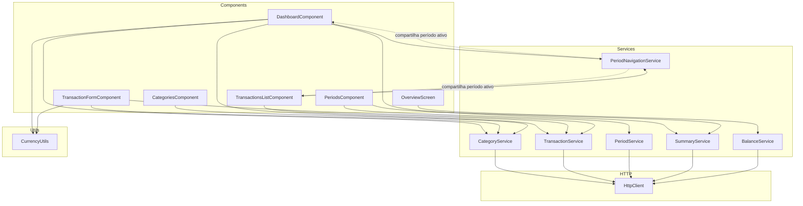
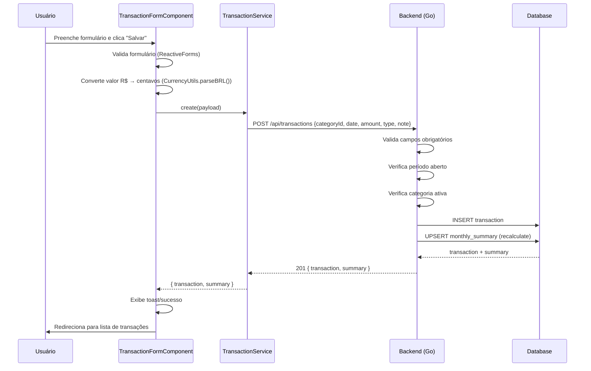

# Plano de Arquitetura — Frontend Angular + Tailwind CSS

## Sumário

1. [Stack Tecnológica](#1-stack-tecnológica)
2. [Princípios SOLID Aplicados](#2-princípios-solid-aplicados)
3. [Estrutura de Diretórios](#3-estrutura-de-diretórios)
4. [Modelos de Dados / Interfaces](#4-modelos-de-dados--interfaces)
5. [Mapeamento de Endpoints da API](#5-mapeamento-de-endpoints-da-api)
6. [Camada de Serviços (Services)](#6-camada-de-serviços-services)
7. [Componentes e Funcionalidades](#7-componentes-e-funcionalidades)
8. [Roteamento com Lazy Loading](#8-roteamento-com-lazy-loading)
9. [Configuração do App (Zoneless / Change Detection)](#9-configuração-do-app-zoneless--change-detection)
10. [Configuração do Tailwind CSS](#10-configuração-do-tailwind-css)
11. [Fluxo de Dados e Exemplos](#11-fluxo-de-dados-e-exemplos)
12. [Plano de Implementação (TODO)](#12-plano-de-implementação-todo)

---

## 1. Stack Tecnológica

| Camada        | Tecnologia                | Versão Mínima |
|---------------|---------------------------|---------------|
| Framework     | Angular (Standalone)      | 17+           |
| Linguagem     | TypeScript                | 5.x           |
| Estilização   | Tailwind CSS              | 3.x           |
| Ícones        | SVG inline                | —             |
| Formulários   | Reactive Forms (nativo)   | —             |
| HTTP          | Angular HttpClient        | —             |
| Build         | Angular CLI               | 17+           |
| Testes        | Jasmine + Karma (padrão)  | —             |

**Nota:** Prefira componentes **standalone** (sem NgModules) para alinhar com Angular 17+ e facilitar lazy loading.

---

## 2. Princípios SOLID Aplicados

### SRP — Single Responsibility Principle

Cada serviço tem **uma única responsabilidade**:

| Serviço                    | Responsabilidade                          |
|----------------------------|-------------------------------------------|
| `CategoryService`          | Operações CRUD de categorias/grupos       |
| `TransactionService`       | Operações CRUD de transações              |
| `PeriodService`            | Listagem e fechamento de períodos         |
| `SummaryService`           | Consulta de resumo mensal                 |
| `BalanceService`           | Consulta do balanço consolidado (visão geral) |
| `CurrencyUtils`            | Formatação de valores (centavos → R$)     |
| `PeriodNavigationService`  | Estado do período selecionado (sessão)    |

### OCP — Open/Closed Principle

Os serviços consomem **interfaces abstratas** via injeção de dependência. Para estender o comportamento (ex.: adicionar cache), basta criar uma nova implementação que implemente a mesma interface e trocá-la no provider.

### LSP — Liskov Substitution Principle

Interfaces definem contratos. Exemplo: `HttpCategoryService` e `FakeCategoryService` (para testes) implementam `CategoryServiceInterface`. Qualquer uma pode ser injetada sem quebrar os consumidores.

### ISP — Interface Segregation Principle

Interfaces são **pequenas e focadas** — cada serviço expõe apenas os métodos de que seus consumidores precisam. Nada de um "megaserviço" genérico.

### DIP — Dependency Inversion Principle

Componentes dependem de **abstrações** (interfaces), não de classes concretas. O Angular Injector resolve a implementação concreta em tempo de execução.

```typescript
// Exemplo de DIP
@Component({...})
export class TransactionListComponent {
  constructor(
    private transactionService: TransactionServiceInterface  // depende da abstração
  ) {}
}
```

---

## 3. Estrutura de Diretórios

```
frontend/
├── src/
│   ├── app/
│   │   ├── app.config.ts              // ApplicationConfig com providers
│   │   ├── app.routes.ts              // Rotas principais (lazy)
│   │   ├── app.ts                     // Root component
│   │   ├── app.html                   // Root template
│   │   ├── app.scss                   // Root styles
│   │   │
│   │   ├── core/                      // Singleton, providers raiz
│   │   │   ├── interfaces/            // Modelos/domínios
│   │   │   │   ├── api.interface.ts
│   │   │   │   ├── balance-snapshot.interface.ts
│   │   │   │   ├── category.interface.ts
│   │   │   │   ├── transaction.interface.ts
│   │   │   │   ├── period.interface.ts
│   │   │   │   ├── summary.interface.ts
│   │   │   │   └── index.ts
│   │   │   │
│   │   │   ├── services/              // Serviços HTTP abstratos
│   │   │   │   ├── base-api.service.ts
│   │   │   │   ├── balance.service.ts
│   │   │   │   ├── category.service.ts
│   │   │   │   ├── transaction.service.ts
│   │   │   │   ├── period.service.ts
│   │   │   │   ├── summary.service.ts
│   │   │   │   ├── period-navigation.service.ts
│   │   │   │   └── index.ts
│   │   │   │
│   │   │   ├── utils/                 // Utilitários
│   │   │   │   ├── currency.utils.ts  // Centavos ↔ R$
│   │   │   │   ├── date.utils.ts      // Formatação de data pt-BR
│   │   │   │   └── index.ts
│   │   │   │
│   │   │   ├── interceptors/          // Interceptores HTTP
│   │   │   │   └── api-error.interceptor.ts
│   │   │   │
│   │   │   └── layouts/               // Layouts compartilhados
│   │   │       └── main-layout.ts     // Sidebar inline
│   │   │
│   │   ├── features/                  // Módulos de funcionalidade (lazy)
│   │   │   ├── dashboard/             // Dashboard + Summary
│   │   │   │   ├── dashboard.ts
│   │   │   │   └── .gitkeep
│   │   │   │
│   │   │   ├── transactions/          // CRUD transações
│   │   │   │   ├── transactions-list.ts       // Lista
│   │   │   │   ├── transaction-form.ts        // Formulário
│   │   │   │   └── .gitkeep
│   │   │   │
│   │   │   ├── categories/            // Gestão de categorias
│   │   │   │   ├── categories.ts
│   │   │   │   └── .gitkeep
│   │   │   │
│   │   │   ├── overview/              // Visão geral do balanço
│   │   │   │   ├── overview.ts
│   │   │   │   └── .gitkeep
│   │   │   │
│   │   │   └── periods/               // Fechamento de períodos
│   │   │       ├── periods.ts
│   │   │       └── .gitkeep
│   │   │
│   │   └── shared/                    // Componentes reutilizáveis
│   │       ├── components/
│   │       │   ├── confirm-dialog.ts
│   │       │   ├── empty-state.ts
│   │       │   ├── error-alert.ts
│   │       │   ├── loading-spinner.ts
│   │       │   └── page-header.ts
│   │       └── pipes/
│   │           └── currency.pipe.ts   // R$ 1.500,00 (CurrencyBRLPipe)
│   │
│   ├── index.html
│   ├── main.ts
│   └── styles.scss                    // Diretivas Tailwind + estilos globais
│
├── angular.json
├── tailwind.config.js
├── postcss.config.js
├── proxy.conf.json                    // Proxy dev para API
├── tsconfig.json
├── package.json
└── docker-entrypoint.sh               // Runtime env vars (Docker)
```

---

## 4. Modelos de Dados / Interfaces

### 4.1 Estrutura Padrão da API

```typescript
// core/interfaces/api.interface.ts

export interface ApiResponse<T = unknown> {
  success: boolean;
  data?: T;
  error?: ApiError;
}

export interface ApiError {
  code: string;
  message: string;
}
```

### 4.2 Category

```typescript
// core/interfaces/category.interface.ts

export type CategoryGroupType = 'revenue' | 'investment' | 'expense';
export type ExpenseType = 'fixed' | 'variable' | 'extra' | 'additional';

export interface CategoryGroup {
  id: number;
  name: string;
  type: CategoryGroupType;
  sortOrder: number;
  createdAt: string;     // ISO datetime
  categories: Category[];
}

export interface Category {
  id: number;
  groupId: number;
  name: string;
  expenseType: ExpenseType | null;
  sortOrder: number;
  active: boolean;
  createdAt: string;
  updatedAt: string;
}

// Payloads para criação/atualização
export interface CreateCategoryPayload {
  groupId: number;
  name: string;
  expenseType?: ExpenseType | null;
  sortOrder?: number;
}

export type UpdateCategoryPayload = Partial<CreateCategoryPayload> & {
  active?: boolean;
};
```

### 4.3 Transaction

```typescript
// core/interfaces/transaction.interface.ts

export type TransactionType = 'income' | 'investment' | 'expense';

export interface Transaction {
  id: number;
  periodId: number;
  categoryId: number;
  date: string;               // YYYY-MM-DD
  amount: number;             // em centavos
  type: TransactionType;
  note: string;
  createdAt: string;
  updatedAt: string;
  categoryName?: string;      // Nome da categoria (populado pela API)
  periodLabel?: string;       // Label do período (populado pela API)
  category?: { id: number; name: string; expenseType?: string | null };
  period?: { id: number; year: number; month: number; closedAt?: string | null };
}

export interface CreateTransactionPayload {
  categoryId: number;
  date: string;
  amount: number;             // em centavos
  type: TransactionType;
  note: string;
}

// PATCH aceita campos parciais
export type UpdateTransactionPayload = Partial<CreateTransactionPayload>;
```

### 4.4 Period

```typescript
// core/interfaces/period.interface.ts

export interface Period {
  id: number;
  year: number;
  month: number;
  label?: string;              // "maio/2026"
  closedAt: string | null;    // null se aberto
  createdAt: string;
  updatedAt: string;
  transactionCount?: number;
  balance?: number;
  expectedRevenue?: number;
  actualRevenue?: number;
  totalExpenses?: number;
  totalInvestments?: number;
}

export interface ClosePeriodPayload {
  year: number;
  month: number;
}
```

### 4.5 MonthlySummary / DetailedSummary

```typescript
// core/interfaces/summary.interface.ts

export interface MonthlySummary {
  id: number;
  periodId: number;
  revenueTotal: number;
  investmentTotal: number;
  fixedExpenseTotal: number;
  variableExpenseTotal: number;
  extraExpenseTotal: number;
  additionalExpenseTotal: number;
  balance: number;
  createdAt: string;
  updatedAt: string;
}

export interface DetailedSummary {
  period: string;
  periodId: number;
  closed: boolean;
  revenue: RevenueSummary;
  investments: InvestmentsSummary;
  expenses: ExpensesSummary;
  balance: number;
  summary: MonthlySummary;
}

export interface CategorySummary {
  categoryId: number;
  categoryName: string;
  amount: number;
}

export interface ExpenseTypeSummary {
  total: number;
  categories: CategorySummary[];
  count: number;
}

export interface RevenueSummary {
  total: number;
  categories: CategorySummary[];
  count: number;
}

export interface InvestmentsSummary {
  total: number;
  categories: CategorySummary[];
  count: number;
}

export interface ExpensesSummary {
  total: number;
  fixed: ExpenseTypeSummary;
  variable: ExpenseTypeSummary;
  extra: ExpenseTypeSummary;
  additional: ExpenseTypeSummary;
}
```

### 4.6 BalanceSnapshot

```typescript
// core/interfaces/balance-snapshot.interface.ts

export interface BalanceSnapshot {
    id: number;
    total_balance: number;
    total_income: number;
    total_expense: number;
    month_count: number;
    calculated_at: string;
    created_at: string;
}
```

> **Nota:** O `BalanceSnapshot` usa **snake_case** nos nomes das propriedades, pois o backend Go serializa com tags `json:"total_balance"` (diferente das outras interfaces que usam camelCase). Os valores monetários são `float64` (não centavos), refletindo o schema REAL da tabela `balance_snapshots`.

---

## 5. Mapeamento de Endpoints da API

Base URL: `http://localhost:8080/api`

| Método | Endpoint                    | Descrição               | Request Body       | Response (data)                        |
|--------|-----------------------------|-------------------------|--------------------|----------------------------------------|
| POST   | `/api/transactions`         | Criar transação         | `CreateTransactionPayload` | `{ transaction, summary }`      |
| GET    | `/api/transactions?period=` | Listar por período      | —                  | `{ transactions[], total, period }`    |
| PATCH  | `/api/transactions/{id}`    | Atualizar transação     | `UpdateTransactionPayload` | `{ transaction, summary }`      |
| DELETE | `/api/transactions/{id}`    | Excluir transação       | —                  | `{ message, summary }`                 |
| GET    | `/api/categories`           | Listar grupos (com cats)| —                  | `{ groups[] }`                         |
| POST   | `/api/categories`           | Criar categoria         | `CreateCategoryPayload` | `Category`                        |
| PATCH  | `/api/categories/{id}`      | Atualizar categoria     | `UpdateCategoryPayload` | `Category`                        |
| DELETE | `/api/categories/{id}`      | Excluir categoria       | —                  | `{ message }`                          |
| GET    | `/api/periods`              | Listar períodos         | —                  | `{ periods[] }`                        |
| POST   | `/api/periods/close`        | Fechar período          | `ClosePeriodPayload` | `{ message, period }`               |
| GET    | `/api/summary?period=`      | Obter resumo mensal     | —                  | `DetailedSummary`                      |
| GET    | `/api/balance`              | Obter snapshot do balanço | —                 | `{ balance: BalanceSnapshot }`         |
| GET    | `/api/health`               | Health check            | —                  | `{ status }`                           |

**Convenção:** A API usa **camelCase** tanto em requests quanto em responses (observado no código Go). Exceção: alguns campos como `expense_type` no request de criação de categoria usam snake_case — convertido via `CategoryService.toSnakeCase()`.

**Formato da resposta de erro:**
```json
{
  "success": false,
  "error": {
    "code": "validation_error",
    "message": "Descrição do erro"
  }
}
```

**Códigos de erro:**
| HTTP Status | Código            | Significado                            |
|-------------|-------------------|----------------------------------------|
| 400         | `validation_error` | Dados inválidos ou campos obrigatórios |
| 404         | `not_found`        | Recurso não encontrado                 |
| 422         | `period_closed`    | Período já está fechado                |
| 409         | `already_closed`   | Tentativa de fechar período já fechado |
| 500         | `internal_error`   | Erro interno do servidor               |

---

## 6. Camada de Serviços (Services)

### 6.1 Diagrama de Dependências



### 6.2 BaseApiService (classe abstrata base)

```typescript
// core/services/base-api.service.ts

export abstract class BaseApiService {
  protected readonly http = inject(HttpClient);
  protected abstract readonly basePath: string;

  /** Constrói a URL completa a partir da base da API + basePath */
  private buildUrl(path?: string): string { /* ... */ }

  /** GET com envelope ApiResponse */
  protected get<T>(path?: string, params?: HttpParams): Observable<T> { /* ... */ }

  /** POST com envelope ApiResponse */
  protected post<T>(body: unknown, path?: string): Observable<T> { /* ... */ }

  /** PATCH com envelope ApiResponse */
  protected patch<T>(id: number, body: unknown): Observable<T> { /* ... */ }

  /** DELETE com envelope ApiResponse */
  protected deleteRequest<T>(id: number): Observable<T> { /* ... */ }

  /** Extrai data do envelope { success, data, error } */
  private extractData<T>(response: ApiResponse<T>): T { /* ... */ }
}
```

### 6.3 CategoryService

```typescript
// core/services/category.service.ts

@Injectable({ providedIn: 'root' })
export class CategoryService extends BaseApiService {
  protected readonly basePath = '/api/categories';

  /** GET /api/categories - Retorna grupos com categorias aninhadas */
  list(): Observable<CategoryGroup[]> {
    return this.get<{ groups: CategoryGroup[] }>().pipe(
      map((response) => response.groups)
    );
  }

  /** POST /api/categories */
  create(payload: CreateCategoryPayload): Observable<Category> {
    return this.post<Category>(this.toSnakeCase(payload));
  }

  /** PATCH /api/categories/:id */
  update(id: number, payload: UpdateCategoryPayload): Observable<Category> {
    return this.patch<Category>(id, this.toSnakeCase(payload));
  }

  /** DELETE /api/categories/:id */
  deleteCategory(id: number): Observable<{ message: string }> {
    return this.deleteRequest<{ message: string }>(id);
  }

  /** Converte camelCase → snake_case para API Go */
  private toSnakeCase(payload: CreateCategoryPayload | UpdateCategoryPayload): Record<string, unknown> { /* ... */ }
}
```

### 6.4 TransactionService

```typescript
// core/services/transaction.service.ts

export interface TransactionListResponse {
  transactions: Transaction[];
  total: number;
  period: string;
}

export interface TransactionCreateResponse {
  transaction: Transaction;
  summary: MonthlySummary;
}

export interface TransactionDeleteResponse {
  message: string;
  summary: MonthlySummary;
}

@Injectable({ providedIn: 'root' })
export class TransactionService extends BaseApiService {
  protected readonly basePath = '/api/transactions';

  /** GET /api/transactions?period=YYYY-MM */
  list(period: string): Observable<TransactionListResponse> {
    const params = new HttpParams().set('period', period);
    return this.get<TransactionListResponse>('', params);
  }

  /** POST /api/transactions */
  create(payload: CreateTransactionPayload): Observable<TransactionCreateResponse> {
    return this.post<TransactionCreateResponse>(payload);
  }

  /** PATCH /api/transactions/:id */
  update(id: number, payload: UpdateTransactionPayload): Observable<TransactionCreateResponse> {
    return this.patch<TransactionCreateResponse>(id, payload);
  }

  /** DELETE /api/transactions/:id */
  deleteTransaction(id: number): Observable<TransactionDeleteResponse> {
    return this.deleteRequest<TransactionDeleteResponse>(id);
  }
}
```

### 6.5 PeriodService

```typescript
// core/services/period.service.ts

export interface PeriodCloseResponse {
  message: string;
  period: Period;
}

@Injectable({ providedIn: 'root' })
export class PeriodService extends BaseApiService {
  protected readonly basePath = '/api/periods';

  /** GET /api/periods */
  list(): Observable<Period[]> {
    return this.get<{ periods: Period[] }>().pipe(
      map((response) => response.periods)
    );
  }

  /** POST /api/periods/close */
  close(payload: ClosePeriodPayload): Observable<PeriodCloseResponse> {
    return this.post<PeriodCloseResponse>(payload, 'close');
  }
}
```

### 6.6 SummaryService

```typescript
// core/services/summary.service.ts

@Injectable({ providedIn: 'root' })
export class SummaryService extends BaseApiService {
  protected readonly basePath = '/api/summary';

  /** GET /api/summary?period=YYYY-MM → DetailedSummary */
  getByPeriod(period: string): Observable<DetailedSummary> {
    const params = new HttpParams().set('period', period);
    return this.get<DetailedSummary>('', params);
  }

  /** Extrai apenas o MonthlySummary do retorno detalhado */
  getMonthlySummary(period: string): Observable<MonthlySummary> {
    const params = new HttpParams().set('period', period);
    return this.get<DetailedSummary>('', params).pipe(
      map((detailed) => detailed.summary)
    );
  }
}
```

### 6.7 BalanceService

```typescript
// core/services/balance.service.ts

@Injectable({ providedIn: 'root' })
export class BalanceService extends BaseApiService {
  protected readonly basePath = '/api/balance';

  /** GET /api/balance → BalanceSnapshot */
  getBalance(): Observable<BalanceSnapshot> {
    return this.get<{ balance: BalanceSnapshot }>().pipe(
      map((response) => response.balance)
    );
  }
}
```

### 6.8 PeriodNavigationService (Estado Compartilhado)

```typescript
// core/services/period-navigation.service.ts

@Injectable({ providedIn: 'root' })
export class PeriodNavigationService {
  private readonly _currentPeriod = new BehaviorSubject<string>(
    this.getDefaultPeriod()
  );

  /** Observable do período ativo no formato YYYY-MM */
  readonly currentPeriod$: Observable<string> = this._currentPeriod.asObservable();

  /** Valor atual (síncrono) */
  get currentPeriod(): string {
    return this._currentPeriod.value;
  }

  /** Navegar para um período */
  navigateToPeriod(period: string): void {
    this._currentPeriod.next(period);
  }

  /** Avançar um mês */
  next(): void {
    this._currentPeriod.next(this.shiftMonth(1));
  }

  /** Voltar um mês */
  previous(): void {
    this._currentPeriod.next(this.shiftMonth(-1));
  }

  private shiftMonth(delta: number): string {
    const [year, month] = this.currentPeriod.split('-').map(Number);
    const date = new Date(year, month - 1 + delta, 1);
    return `${date.getFullYear()}-${String(date.getMonth() + 1).padStart(2, '0')}`;
  }

  private getDefaultPeriod(): string {
    const now = new Date();
    return `${now.getFullYear()}-${String(now.getMonth() + 1).padStart(2, '0')}`;
  }
}
```

### 6.8 CurrencyUtils (Classe Utilitária Estática — não é injetável)

```typescript
// core/utils/currency.utils.ts

export class CurrencyUtils {
  /** Converte centavos para float (ex: 150000 → 1500.00) */
  static centsToFloat(cents: number): number {
    return cents / 100;
  }

  /** Converte float para centavos (ex: 1500.00 → 150000) */
  static floatToCents(value: number): number {
    return Math.round(value * 100);
  }

  /** Formata centavos como moeda BRL (ex: 150000 → "R$ 1.500,00") */
  static formatBRL(cents: number): string {
    return new Intl.NumberFormat('pt-BR', {
      style: 'currency',
      currency: 'BRL',
    }).format(this.centsToFloat(cents));
  }

  /** Formata centavos como número compacto (ex: 150000 → "1.500,00") */
  static formatNumber(cents: number): string {
    return new Intl.NumberFormat('pt-BR', {
      minimumFractionDigits: 2,
      maximumFractionDigits: 2,
    }).format(this.centsToFloat(cents));
  }

  /** Converte string BRL para centavos (ex: "1.500,00" → 150000) */
  static parseBRL(value: string): number {
    const cleaned = value.replace(/[R$\s]/g, '').replace(/\./g, '').replace(',', '.');
    const floatValue = parseFloat(cleaned);
    return isNaN(floatValue) ? 0 : this.floatToCents(floatValue);
  }
}
```

---

## 7. Componentes e Funcionalidades

### 7.1 Árvore de Componentes (Resumo Visual)

```mermaid
flowchart LR
    subgraph Layout
        A[AppComponent]
        ML[MainLayout - sidebar inline]
    end

    subgraph Shared
        PH[PageHeaderComponent]
        LS[LoadingSpinnerComponent]
        ES[EmptyStateComponent]
        EA[ErrorAlertComponent]
        CD[ConfirmDialogComponent]
    end

    subgraph Dashboard "feature: dashboard"
        D[DashboardComponent]
    end

    subgraph Overview "feature: overview"
        OS[OverviewScreen - Balanço]
    end

    subgraph Transactions "feature: transactions"
        TL[TransactionsList - Lista]
        TF[TransactionForm - Cria]
    end

    subgraph Categories "feature: categories"
        CC[CategoriesComponent]
    end

    subgraph Periods "feature: periods"
        PC[PeriodsComponent]
    end

    A --> ML
    ML --> |router-outlet| D
    ML --> |router-outlet| OS
    ML --> |router-outlet| TL
    ML --> |router-outlet| TF
    ML --> |router-outlet| CC
    ML --> |router-outlet| PC
```

### 7.2 Descrição dos Componentes

#### DashboardComponent
- **Rota:** `/` (carregado como rota padrão)
- **Arquivo:** [`features/dashboard/dashboard.ts`](frontend/src/app/features/dashboard/dashboard.ts)
- **Responsabilidade:** Exibe resumo do mês atual (ou selecionado)
- **Dados:** busca `SummaryService.getByPeriod()` + `TransactionService.list()`
- **Navegador de período:** botões "mês anterior/próximo" no sidebar (via `PeriodNavigationService`)

#### TransactionsList
- **Rota:** `/transactions`
- **Arquivo:** [`features/transactions/transactions-list.ts`](frontend/src/app/features/transactions/transactions-list.ts)
- **Responsabilidade:** Lista transações do período
- **Parâmetro de consulta:** `?period=2026-05` (usa o período ativo do `PeriodNavigationService`)
- **Ações:** botão "Nova Transação" → `/transactions/new`

#### TransactionForm
- **Rota:** `/transactions/new`
- **Arquivo:** [`features/transactions/transaction-form.ts`](frontend/src/app/features/transactions/transaction-form.ts)
- **Responsabilidade:** Formulário de criação de transação (não existe rota de edição)
- **Campos:**
  - `type` (select: Receita / Investimento / Despesa)
  - `categoryId` (select dependente do `type` selecionado)
  - `date` (input date, formato YYYY-MM-DD)
  - `amount` (input numérico em reais, convertido para centavos no submit)
  - `note` (textarea, obrigatório)
- **Validações:** Reactive Forms com validadores customizados
- **Conversão:** Valor em reais (R$) → centavos (integer) via `CurrencyUtils.parseBRL()`

#### CategoriesComponent
- **Rota:** `/categories`
- **Arquivo:** [`features/categories/categories.ts`](frontend/src/app/features/categories/categories.ts)
- **Responsabilidade:** Gestão completa de grupos e categorias
- **Ações:** Ativar/desativar toggle, editar nome, excluir

#### PeriodsComponent
- **Rota:** `/periods`
- **Arquivo:** [`features/periods/periods.ts`](frontend/src/app/features/periods/periods.ts)
- **Responsabilidade:** Lista períodos com indicador de aberto/fechado e ação de fechar
- **Dados:** `PeriodService.list()`
- **Ações:** Botão "Fechar Período" com confirmação

#### OverviewScreen
- **Rota:** `/overview`
- **Arquivo:** [`features/overview/overview.ts`](frontend/src/app/features/overview/overview.ts)
- **Responsabilidade:** Exibe visão geral do balanço consolidado (todos os períodos)
- **Dados:** `BalanceService.getBalance()` → `BalanceSnapshot`
- **Layout:** Cards com `total_balance`, `total_income`, `total_expense` e `month_count`, formatados com `CurrencyBRLPipe`

---

## 8. Roteamento com Lazy Loading

### Rotas Principais

```typescript
// app.routes.ts

export const routes: Routes = [
  {
    path: '',
    loadComponent: () => import('./core/layouts/main-layout').then((c) => c.MainLayout),
    children: [
      {
        path: '',
        loadComponent: () => import('./features/dashboard/dashboard').then((c) => c.default),
        title: 'Dashboard - Finance Tracker',
      },
      {
        path: 'overview',
        loadComponent: () => import('./features/overview/overview').then((c) => c.default),
        title: 'Visão Geral - Finance Tracker',
      },
      {
        path: 'transactions',
        loadComponent: () => import('./features/transactions/transactions-list').then((c) => c.default),
        title: 'Transações - Finance Tracker',
      },
      {
        path: 'transactions/new',
        loadComponent: () => import('./features/transactions/transaction-form').then((c) => c.default),
        title: 'Nova Transação - Finance Tracker',
      },
      {
        path: 'categories',
        loadComponent: () => import('./features/categories/categories').then((c) => c.default),
        title: 'Categorias - Finance Tracker',
      },
      {
        path: 'periods',
        loadComponent: () => import('./features/periods/periods').then((c) => c.default),
        title: 'Períodos - Finance Tracker',
      },
      {
        path: '**',
        redirectTo: '',
      },
    ],
  },
];
```

### Tabela de Rotas

| Caminho               | Componente           | Carregamento   | Título                           |
|-----------------------|----------------------|----------------|----------------------------------|
| `/`                   | DashboardComponent   | `loadComponent` | Dashboard - Finance Tracker      |
| `/overview`           | OverviewScreen       | `loadComponent` | Visão Geral - Finance Tracker    |
| `/transactions`       | TransactionsList     | `loadComponent` | Transações - Finance Tracker     |
| `/transactions/new`   | TransactionForm      | `loadComponent` | Nova Transação - Finance Tracker |
| `/categories`         | CategoriesComponent  | `loadComponent` | Categorias - Finance Tracker     |
| `/periods`            | PeriodsComponent     | `loadComponent` | Períodos - Finance Tracker       |
| `**`                  | — (redirect to `/`)  | —              | —                                |

**Nota:** Não existe rota de edição (`/transactions/:id/edit`). O formulário é apenas para criação. Todas as rotas usam `loadComponent` com `() => import(...)` para lazy loading, sem `loadChildren` ou rotas filhas aninhadas.

### Estrutura do MainLayout (sidebar inline, sem componente separado)

```typescript
// core/layouts/main-layout.ts

@Component({
  selector: 'app-main-layout',
  standalone: true,
  imports: [RouterOutlet, RouterLink, RouterLinkActive, AsyncPipe],
  template: `
    <div class="flex h-screen overflow-hidden bg-gray-50">
      <!-- Sidebar (inline, sem SidebarComponent separado) -->
      <aside
        class="fixed inset-y-0 left-0 z-30 w-64 transform bg-white shadow-lg transition-transform duration-300 lg:static lg:translate-x-0"
        [class.-translate-x-full]="!sidebarOpen()"
      >
        <div class="flex h-full flex-col">
          <!-- Logo -->
          <div class="flex h-16 items-center justify-between border-b border-gray-200 px-6">
            <span class="text-xl font-bold text-indigo-600">Finance Tracker</span>
          </div>

          <!-- Period Navigation -->
          <div class="border-b border-gray-200 px-4 py-4">
            <div class="flex items-center justify-between">
              <button (click)="periodNav.previous()" title="Mês anterior">◀</button>
              <span>{{ DateUtils.periodToMonthName(period) }}</span>
              <button (click)="periodNav.next()" title="Próximo mês">▶</button>
            </div>
          </div>

          <!-- Navigation -->
          <nav class="flex-1 space-y-1 px-3 py-4">
            @for (item of navItems; track item.path) {
              <a [routerLink]="item.path" routerLinkActive="bg-indigo-50 text-indigo-700"
                 class="flex items-center gap-3 rounded-lg px-3 py-2.5 text-sm font-medium text-gray-700 hover:bg-gray-100">
                {{ item.label }}
              </a>
            }
          </nav>
        </div>
      </aside>

      <!-- Overlay (mobile) - toggle via click -->
      @if (sidebarOpen()) {
        <div class="fixed inset-0 z-20 bg-black/50 lg:hidden" (click)="toggleSidebar()"></div>
      }

      <!-- Main Content -->
      <div class="flex flex-1 flex-col overflow-hidden">
        <!-- Top Bar (mobile) -->
        <header class="flex h-16 items-center border-b border-gray-200 bg-white px-4 lg:hidden">
          <button (click)="toggleSidebar()" class="rounded-lg p-2 text-gray-500 hover:bg-gray-100">
            ☰
          </button>
        </header>

        <!-- Page Content -->
        <main class="flex-1 overflow-y-auto p-4 lg:p-8">
          <router-outlet />
        </main>
      </div>
    </div>
  `,
})
export class MainLayout {
  protected readonly periodNav = inject(PeriodNavigationService);
  protected readonly DateUtils = DateUtils;
  protected readonly period$ = this.periodNav.currentPeriod$;
  protected readonly sidebarOpen = signal(false);

  protected readonly navItems = [
    { path: '/', label: 'Dashboard', exact: true },
    { path: '/overview', label: 'Visão Geral', exact: false },
    { path: '/transactions', label: 'Transações', exact: false },
    { path: '/categories', label: 'Categorias', exact: false },
    { path: '/periods', label: 'Períodos', exact: false },
  ];

  toggleSidebar(): void {
    this.sidebarOpen.update((v) => !v);
  }
}
```

**Sidebar:** A sidebar é inline no template do `MainLayout`. Não existe um `SidebarComponent` separado. O toggle do sidebar em mobile é feito via `toggleSidebar()` (chamado pelo overlay `(click)` e pelo botão hamburger), com um `signal<boolean>` controlando a classe `-translate-x-full`.

---

## 9. Configuração do App (Change Detection)

**Real:** O [`app.config.ts`](frontend/src/app/app.config.ts) não usa `provideExperimentalZonelessChangeDetection`. Usa `provideBrowserGlobalErrorListeners()`, `provideRouter(routes)` e `provideHttpClient(withInterceptors([apiErrorInterceptor]))`. O change detection é o padrão do Angular (Zone-based).

```typescript
// app.config.ts

import { ApplicationConfig, provideBrowserGlobalErrorListeners } from '@angular/core';
import { provideRouter } from '@angular/router';
import { provideHttpClient, withInterceptors } from '@angular/common/http';

import { routes } from './app.routes';
import { apiErrorInterceptor } from './core/interceptors/api-error.interceptor';

export const appConfig: ApplicationConfig = {
  providers: [
    provideBrowserGlobalErrorListeners(),
    provideRouter(routes),
    provideHttpClient(
      withInterceptors([apiErrorInterceptor])
    ),
  ],
};
```

---

## 10. Configuração do Tailwind CSS

```javascript
// tailwind.config.js
/** @type {import('tailwindcss').Config} */
module.exports = {
  content: [
    "./src/**/*.{html,ts}",
  ],
  theme: {
    extend: {
      colors: {
        // Cores semânticas para o sistema financeiro
        revenue: {
          DEFAULT: '#16a34a',  // green-600
          light: '#dcfce7',    // green-100
        },
        expense: {
          DEFAULT: '#dc2626',  // red-600
          light: '#fee2e2',    // red-100
        },
        investment: {
          DEFAULT: '#2563eb',  // blue-600
          light: '#dbeafe',    // blue-100
        },
      },
    },
  },
  plugins: [],
};
```

```css
/* styles.scss */
@tailwind base;
@tailwind components;
@tailwind utilities;

@layer base {
  body {
    @apply bg-gray-50 text-gray-900 antialiased;
  }
}
```

---

## 11. Fluxo de Dados e Exemplos

### 11.1 Fluxo: Usuário cria uma transação



### 11.2 Exemplo: TransactionFormComponent com ReactiveForms

```typescript
// features/transactions/transaction-form.ts (trecho conceitual)

@Component({
  selector: 'app-transaction-form',
  standalone: true,
  imports: [ReactiveFormsModule, RouterLink, AsyncPipe],
  template: `
    <form [formGroup]="form" (ngSubmit)="onSubmit()" class="space-y-4">
      <!-- Tipo -->
      <div>
        <label class="block text-sm font-medium">Tipo</label>
        <select formControlName="type" class="w-full border rounded-lg px-3 py-2">
          <option value="">Selecione...</option>
          <option value="income">Receita</option>
          <option value="investment">Investimento</option>
          <option value="expense">Despesa</option>
        </select>
      </div>

      <!-- Categoria (filtrada pelo tipo selecionado) -->
      <div>
        <label class="block text-sm font-medium">Categoria</label>
        <select formControlName="categoryId" class="w-full border rounded-lg px-3 py-2">
          <option value="">Selecione...</option>
          @for (cat of filteredCategories(); track cat.id) {
            <option [value]="cat.id">{{ cat.name }}</option>
          }
        </select>
      </div>

      <!-- Data -->
      <div>
        <label class="block text-sm font-medium">Data</label>
        <input type="date" formControlName="date" class="w-full border rounded-lg px-3 py-2" />
      </div>

      <!-- Valor (em reais, convertido internamente) -->
      <div>
        <label class="block text-sm font-medium">Valor (R$)</label>
        <input type="text" formControlName="amountDisplay" placeholder="1.500,00"
               class="w-full border rounded-lg px-3 py-2" />
      </div>

      <!-- Observação -->
      <div>
        <label class="block text-sm font-medium">Observação</label>
        <textarea formControlName="note" rows="3" class="w-full border rounded-lg px-3 py-2"></textarea>
      </div>

      <!-- Botões -->
      <div class="flex gap-3">
        <button type="submit" [disabled]="form.invalid || loading"
                class="bg-blue-600 text-white px-6 py-2 rounded-lg hover:bg-blue-700 disabled:opacity-50">
          Criar
        </button>
        <a routerLink="/transactions" class="px-6 py-2 rounded-lg border hover:bg-gray-50">
          Cancelar
        </a>
      </div>
    </form>
  `,
})
export class TransactionFormComponent {
  private fb = inject(FormBuilder);
  private transactionService = inject(TransactionService);
  private categoryService = inject(CategoryService);
  private router = inject(Router);

  form = this.fb.nonNullable.group({
    type: ['', Validators.required],
    categoryId: [0, Validators.required],
    date: ['', Validators.required],
    amountDisplay: ['', [Validators.required, this.amountValidator()]],
    note: ['', [Validators.required, Validators.minLength(1)]],
  });

  categories: Category[] = [];
  loading = false;

  get filteredCategories(): Signal<Category[]> {
    // Filtra categorias com base no tipo de transação selecionado
    return computed(() => {
      const type = this.form.value.type;
      return this.categories.filter(c => /* lógica de filtro */);
    });
  }

  onSubmit(): void {
    if (this.form.invalid) return;
    this.loading = true;

    const formValue = this.form.getRawValue();
    const payload: CreateTransactionPayload = {
      categoryId: formValue.categoryId,
      date: formValue.date,
      amount: CurrencyUtils.parseBRL(formValue.amountDisplay),
      type: formValue.type as TransactionType,
      note: formValue.note,
    };

    this.transactionService.create(payload).pipe(
      finalize(() => (this.loading = false))
    ).subscribe({
      next: () => this.router.navigate(['/transactions']),
      error: (err) => /* tratar erro */,
    });
  }

  private amountValidator(): ValidatorFn {
    return (control: AbstractControl): ValidationErrors | null => {
      const num = CurrencyUtils.parseBRL(control.value || '');
      return num <= 0 ? { invalidAmount: true } : null;
    };
  }
}
```

### 11.3 Tratamento de Erros (Interceptor Funcional)

```typescript
// core/interceptors/api-error.interceptor.ts

export const apiErrorInterceptor: HttpInterceptorFn = (req, next) => {
  return next(req).pipe(
    catchError((error: HttpErrorResponse) => {
      let message = 'Erro inesperado. Tente novamente.';

      if (error.error?.error?.message) {
        message = error.error.error.message;
      } else if (error.error?.message) {
        message = error.error.message;
      } else if (error.status === 0) {
        message = 'Não foi possível conectar ao servidor. Verifique sua conexão.';
      } else if (error.status === 500) {
        message = 'Erro interno do servidor. Tente novamente mais tarde.';
      }

      const appError: AppHttpError = {
        status: error.status,
        code: error.error?.error?.code ?? 'unknown_error',
        message,
        originalError: error,
      };

      return throwError(() => appError);
    })
  );
};

export interface AppHttpError {
  status: number;
  code: string;
  message: string;
  originalError: HttpErrorResponse;
}
```

**Nota:** O interceptor é uma **função** (`HttpInterceptorFn`), não uma classe com `@Injectable()`. Não existe `HttpErrorInterceptor` como classe — o export é `apiErrorInterceptor`.

---

## 12. Plano de Implementação (TODO)

### Fase 1 — Setup do Projeto

- [ ] 1.1 Scaffold do projeto Angular (`ng new finance-tracker --standalone`)
- [ ] 1.2 Configurar Tailwind CSS (instalação manual)
- [ ] 1.3 Configurar Tailwind (`tailwind.config.js`, `postcss.config.js`, estilos globais)
- [ ] 1.4 Criar estrutura de diretórios (`core/`, `features/`, `shared/`)
- [ ] 1.5 Configurar `proxy.conf.json` para API em dev

### Fase 2 — Core (Interfaces, Serviços, Utilitários)

- [ ] 2.1 Criar interfaces de domínio (`core/interfaces/`)
- [ ] 2.2 Criar `BaseApiService` (classe abstrata)
- [ ] 2.3 Criar `CategoryService`
- [ ] 2.4 Criar `TransactionService`
- [ ] 2.5 Criar `PeriodService`
- [ ] 2.6 Criar `SummaryService`
- [ ] 2.7 Criar `PeriodNavigationService` (estado compartilhado)
- [ ] 2.8 Criar `CurrencyUtils` (classe estática)
- [ ] 2.9 Criar `apiErrorInterceptor` (função `HttpInterceptorFn`)
- [ ] 2.10 Configurar providers no `app.config.ts`

### Fase 3 — Layout e Navegação

- [ ] 3.1 Criar `MainLayout` (sidebar inline + router-outlet + navegação de período)
- [ ] 3.2 Configurar rotas com lazy loading (`app.routes.ts`)
- [ ] 3.3 Criar componentes compartilhados (`LoadingSpinner`, `EmptyState`, `ConfirmDialog`, `PageHeader`, `ErrorAlert`)

### Fase 4 — Feature: Dashboard

- [ ] 4.1 Criar `DashboardComponent`
- [ ] 4.2 Integrar `SummaryService.getByPeriod()`
- [ ] 4.3 Integrar navegador de período (sidebar via `PeriodNavigationService`)
- [ ] 4.4 Exibir cards de resumo (receitas, despesas, investimentos, saldo)

### Fase 5 — Feature: Transações

- [ ] 5.1 Criar `TransactionsList` (lista com tabela)
- [ ] 5.2 Criar `TransactionForm` (formulário de criação)
- [ ] 5.3 Integrar validações de formulário
- [ ] 5.4 Integrar `CurrencyUtils.parseBRL()` para conversão de valores

### Fase 6 — Feature: Categorias

- [ ] 6.1 Criar `CategoriesComponent`
- [ ] 6.2 Listar grupos com categorias aninhadas
- [ ] 6.3 Ativar/desativar toggle
- [ ] 6.4 Confirmar exclusão com `ConfirmDialog`

### Fase 7 — Feature: Períodos

- [ ] 7.1 Criar `PeriodsComponent` (lista de períodos)
- [ ] 7.2 Implementar ação de fechar período
- [ ] 7.3 Exibir resumo agregado por período

### Fase 8 — Polimento

- [ ] 8.1 Adicionar loading states em todos os componentes
- [ ] 8.2 Adicionar empty states ("Nenhuma transação encontrada")
- [ ] 8.3 Adicionar tratamento de erros com notificações
- [ ] 8.4 Responsividade mobile (ajustes Tailwind)
- [ ] 8.5 Testar integração ponta a ponta com backend

### Fase 9 — Feature: Visão Geral (Overview)

- [ ] 9.1 Criar interface `BalanceSnapshot` (`core/interfaces/balance-snapshot.interface.ts`)
- [ ] 9.2 Criar `BalanceService` (`core/services/balance.service.ts`)
- [ ] 9.3 Criar `OverviewScreen` (componente com cards de balanço)
- [ ] 9.4 Adicionar rota `/overview` com lazy loading
- [ ] 9.5 Adicionar link "Visão Geral" na sidebar (`navItems`)
- [ ] 9.6 Adicionar item ao `core/interfaces/index.ts` e `core/services/index.ts`

---

## Apêndice A: Regras de Negócio do Backend (para referência)

| Regra | Descrição |
|-------|-----------|
| **Valor em centavos** | `amount` é INTEGER em centavos (R$ 1.500,00 → 150000) |
| **Note obrigatório** | Toda transação deve ter `note` com pelo menos 1 caractere |
| **Categoria ativa** | Só é possível criar transações em categorias ativas |
| **Período aberto** | Só é possível criar/alterar/excluir transações em períodos abertos (sem `closedAt`) |
| **Summary automático** | O resumo mensal (`monthly_summaries`) é recalculado a cada CRUD de transação |
| **Categoria expense** | Se o grupo é do tipo `expense`, o campo `expenseType` é obrigatório |
| **Tipo compatível** | `expenseType` válidos: `fixed`, `variable`, `extra`, `additional` |
| **Nome único por grupo** | Não podem existir duas categorias com o mesmo nome dentro do mesmo grupo |

## Apêndice B: Decisões Técnicas

| Decisão | Escolha | Motivo |
|---------|---------|--------|
| Componentes Standalone | Angular 17+ standalone components | Menos boilerplate, lazy loading nativo |
| Reactive Forms | Angular ReactiveFormsModule | Validação síncrona/assíncrona, tipagem forte |
| Estado de período | BehaviorSubject em serviço singleton | Compartilhado entre rotas sem prop drilling |
| Formatação monetária | `Intl.NumberFormat` (nativo) via `CurrencyUtils` | Sem dependência extra, locale pt-BR |
| Ícones | SVG inline | Simplicidade inicial, sem lib externa |
| HttpClient + Interceptor funcional | `HttpInterceptorFn` | Tratamento centralizado de erros da API |
| Pipes vs Métodos | Pipes `pure` para formatação em templates | Performance (recalculam apenas se input mudar) |
| Sidebar | Inline no MainLayout | Simplicidade, sem componente separado |
| BaseApiService | Classe abstrata com `HttpClient` | DRY, envelope padronizado, OCP via herança |
| CurrencyUtils | Classe com métodos `static` | Utilitário puro, sem injeção de dependência |
